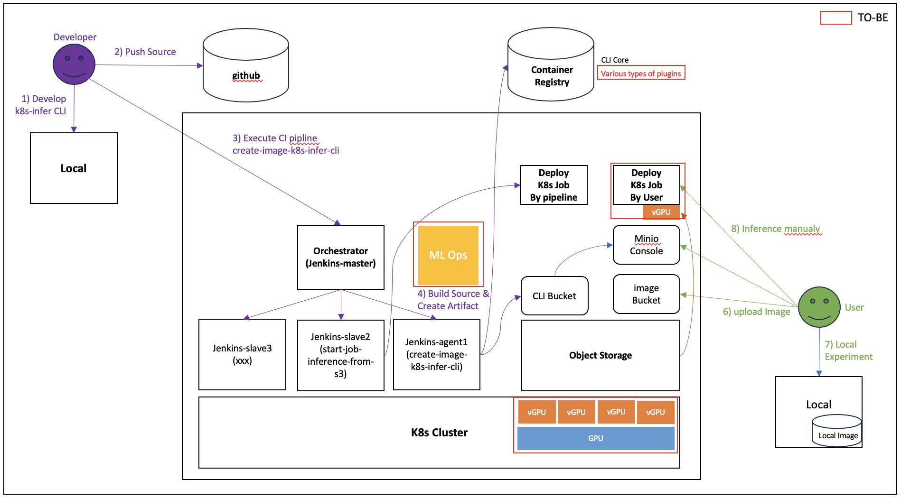

# Overview
This Repo is about Inference Testing ImageNet Image using CLI(k8s-infer) developed in Python. k8s-infer CLI includes the following functions.   
     - Inference through Pretrained Torchvision Model   
     - Error handling for parameter input values when performing CLI    
     - Perform Inference using Kubernetes Resource (Pod or Job) 
     - Perform Image Inference using Object Storage and Local Path  
     - A plan to recycle pytorch checkpoints downloaded with pretrained weights (a plan to avoid repeated downloads)    


In addition, I also considered a Batch Pipeline(Jenkinsfile) to infer a large number of images in Object Storage and a plan to prevent Kubernetes Resource overwhelmed due to excessive CLI use.    

## Tasks    
1. Development of Command Line Interface    
    - Create a CLI tool named k8s-infer using Python   
    - Inference through Pretrained Torchvision Model   
    - Error handling for parameter input values when performing CLI    
    - Perform Inference using Kubernetes Resource (Pod or Job) 
    - A plan to recycle pytorch checkpoints downloaded with pretrained weights (a plan to avoid repeated downloads)    

2. Scheduling
    - Measures to prepare for Kubernetes resource shortage due to excessive CLI use 
    - Creating a batch pipeline using Jenkins   

## Develop Environment  
    - Python virtualization environment (Local) through pipenv  
    - Main Python Packages include python3.10, argparse, setuptools, torchvision1.13.1  
    - kind cluster for local K8s    

## Contents
```
- Architecture and implementation plan ( Platform/SW/CLI UseCase)
- CLI Packaging (Continuous CI performance through local and pipeline)
- CASE TEST(Running Test) For Task1
- Scheduling For Task2
- TO-BE (Architecture/lessons learned)
```

## Architecture and implementation plan
### 1) Whole Architecture
  

### 2) Logic implementation plan for image inference  
  

### 3) How to use k8s-infer CLI
     


## CLI Packaging
```bash
### 1. Virtualization environment setup through pipenv  
# pipenv install for python virtualization environment  
$ brew install pipenv  # mac

# Manage packages through pipenv, navigate to the directory, and install the required python version.   
$ cd {TARGET_DIR}
$ pipenv --python 3.10

# After executing the above command, Pipfile and Pipfile.lock files are created, and the virtualization environment is activated through pipenv shell.  
$ pipenv shell
Launching subshell in virtual environment...
 . /Users/dbha/.local/share/virtualenvs/img-classification/bin/activate

(technical-interview-cloud-engineer-dbha-private)  dbha  ~/Workspaces/git/img-classification

# When running python, check that version 3.10 is installed.
$ python
Python 3.10.13 (main, Jan 10 2024, 15:04:45) [Clang 15.0.0 (clang-1500.1.0.2.5)] on darwin
Type "help", "copyright", "credits" or "license" for more information.


### 2. Create setup.py through the setuptools module to package the python project.
```bash
cd k8s_infer

from setuptools import setup, find_packages

setup(
    name="k8s-infer",
    version="0.0.1",
    author="dbha",
    author_email="dbha0719@gamil.com",
    description=("demonstrate python module and tool packaging."),
    # long_description=long_description,
    # long_description_content_type="text/markdown",
    classifiers=[
        "Programming Language :: Python :: 3",
        "License :: OSI Approved :: MIT License",
        "Operating System :: OS Independent",
    ],
    install_requires=[
        'argon2-cffi==23.1.0',
    ...
    ],
    # packages=find_packages(include=['k8s_infer', 'k8s_infer.*']),
    packages=find_packages(),
    python_requires=">=3.6",
    entry_points={
        "console_scripts": [
            "k8s-infer = k8s_infer.cli:main"      
        ]
    }    
```

### 3. Perform packaging
$ pip install .
Processing /Users/dbha/Workspaces/git/img-classification/k8s_infer
  Preparing metadata (setup.py) ... done
Requirement already satisfied: argon2-cffi==23.1.0 in /Users/dbha/.local/share/virtualenvs/technical-interview-cloud-engineer-dbha-pr-qk9o-Xq4/lib/python3.10/site-packages (from k8s-infer==0.0.1) (23.1.0)
Requirement already satisfied: argon2-cffi-bindings==21.2.0 in /Users/dbha/.local/share/virtualenvs/technical-interview-cloud-engineer-dbha-pr-qk9o-Xq4/lib/python3.10/site-packages (from k8s-infer==0.0.1) (21.2.0)
....
...
Successfully built k8s-infer
Installing collected packages: k8s-infer
  Attempting uninstall: k8s-infer
    Found existing installation: k8s-infer 0.0.1
    Uninstalling k8s-infer-0.0.1:
      Successfully uninstalled k8s-infer-0.0.1
Successfully installed k8s-infer-0.0.1

$ ls -lrt k8s-infer
-rwxr-xr-x@ 1 dbha  staff  295 Jan 19 18:10 k8s-infer
```

```bash
### Continuous CLI and Container Image creation from CI perspective ###
# Requirement 
- Continuous CLI deployment required due to source changes(Object Storage)
- Container Image creation required for K8s deployment

# Check pipeline
$ https://github.com/dbha/technical-interview-cloud-engineer-dbha-private/blob/main/01_Jenkinsfile_Create_Image_k8s_infer_cli

```
## CASE TEST (For Task1)
### k8s-infer Operation by CASE1

```bash
# 테스트를 위해 tmp 영역으로 파일 Copy
mkdir -p /tmp/local/existing/imagenet-classes/
mkdir -p /tmp/local/existing/images/

cp ~/Workspaces/rebellions/imagenet-classes/imagenet_classes.txt  /tmp/local/existing/imagenet-classes/
cp ~//Workspaces/rebellions/download-s3-images/ILSVRC2012_val_00000099.JPEG  /tmp/local/existing/images/
cp ~//Workspaces/rebellions/download-s3-images/ILSVRC2012_val_00000100.JPEG  /tmp/local/existing/images/
```
```bash
# CASE1은 Local 환경에서 사전에 저장된 image 위치를 지정하여 Inference 하는 방식입니다.

# Help 
$ ./k8s-infer --help

usage: k8s-infer [-h] [--models model1,model2,model3] [--image IMAGE] [--type TYPE] [--endpoint ENDPOINT] [--access_key ACCESS_KEY] [--secret_key SECRET_KEY] [--images_bucket IMAGES_BUCKET] [--classes_bucket CLASSES_BUCKET]
                 [--yaml YAML] [--workload WORKLOAD]

k8s-infer CLI to demonstrate ml inference leveraging torchvision model

options:
  -h, --help            show this help message and exit
  --models model1,model2,model3
                        Input pre-trained Models by Comma-separated values
  --image IMAGE         Input Image Path
  --type TYPE           Input Local or S3
  --endpoint ENDPOINT   Input s3 end_point
  --access_key ACCESS_KEY
                        Input S3 Access key
  --secret_key SECRET_KEY
                        Input S3 Secret Key
  --images_bucket IMAGES_BUCKET
                        Input Bucket name where the image is saved
  --classes_bucket CLASSES_BUCKET
                        Input Bucket name where the classes files is saved
  --yaml YAML           Enter the yaml path where you want to deploy Kubernetes. In this case, Only the --yaml file path and --type(S3 or Local) option must be used for deployment.
  --workload WORKLOAD   How to get images to make inferences, In this case, default is ' '.
```
```bash
# Error Test(파라미터 미지정, 이미지파일 type, 이미지파일 미접근, 다중모델명등)
$ ./k8s-infer --models
usage: k8s-infer [-h] [--models model1,model2,model3] [--image IMAGE] [--type TYPE] [--endpoint ENDPOINT] [--access_key ACCESS_KEY] [--secret_key SECRET_KEY] [--images_bucket IMAGES_BUCKET] [--classes_bucket CLASSES_BUCKET]
                 [--yaml YAML] [--workload WORKLOAD]
k8s-infer: error: argument --models: expected one argument

$ ./k8s-infer --models alexnet
valid model : alexnet

Please Input type only S3 or Local

$ ./k8s-infer --models alexnet,resnet
valid model : alexnet
valid model : resnet

Please Input type only S3 or Local

$ ./k8s-infer --models alexnet,resnet90
valid model : alexnet
invaild model : resnet90

$ ./k8s-infer --models alexnet,resnet50,googlenet
valid model : alexnet
valid model : resnet50
valid model : googlenet

Please Input type only S3 or Local

$ ./k8s-infer --models alexnet,resnet50,googlenet --type Local
valid model : alexnet
valid model : resnet50
valid model : googlenet
type:  Local

Please Input image path

$ ./k8s-infer --models googlenet --type Local --image /tmp/local/existing/images/ILSVRC2012_val_00000099.jpg
valid model : googlenet
type:  Local

invaild image_type : /tmp/local/existing/images/ILSVRC2012_val_00000099.jpg

$ ./k8s-infer --models googlenet --type Local --image  /root/test.JPEG
valid model : googlenet
type:  Local
valid image_type : /root/test.JPEG


model_class :  <function googlenet at 0x11a8c23b0>
/Users/dbha/.local/share/virtualenvs/technical-interview-cloud-engineer-dbha-pr-qk9o-Xq4/lib/python3.10/site-packages/torchvision/models/_utils.py:208: UserWarning: The parameter 'pretrained' is deprecated since 0.13 and may be removed in the future, please use 'weights' instead.
  warnings.warn(
/Users/dbha/.local/share/virtualenvs/technical-interview-cloud-engineer-dbha-pr-qk9o-Xq4/lib/python3.10/site-packages/torchvision/models/_utils.py:223: UserWarning: Arguments other than a weight enum or `None` for 'weights' are deprecated since 0.13 and may be removed in the future. The current behavior is equivalent to passing `weights=GoogLeNet_Weights.IMAGENET1K_V1`. You can also use `weights=GoogLeNet_Weights.DEFAULT` to get the most up-to-date weights.
  warnings.warn(msg)

An unexpected error occurred: [Errno 2] No such file or directory: '/root/test.JPEG'
```
```bash
# Inference testing for CASE3
$ ./k8s-infer --models googlenet --type Local --image /tmp/local/existing/images/ILSVRC2012_val_00000099.JPEG

valid model : googlenet
type:  Local
valid image_type : /tmp/local/existing/images/ILSVRC2012_val_00000099.JPEG


model_class :  <function googlenet at 0x10bca63b0>
/Users/dbha/.local/share/virtualenvs/technical-interview-cloud-engineer-dbha-pr-qk9o-Xq4/lib/python3.10/site-packages/torchvision/models/_utils.py:208: UserWarning: The parameter 'pretrained' is deprecated since 0.13 and may be removed in the future, please use 'weights' instead.
  warnings.warn(
/Users/dbha/.local/share/virtualenvs/technical-interview-cloud-engineer-dbha-pr-qk9o-Xq4/lib/python3.10/site-packages/torchvision/models/_utils.py:223: UserWarning: Arguments other than a weight enum or `None` for 'weights' are deprecated since 0.13 and may be removed in the future. The current behavior is equivalent to passing `weights=GoogLeNet_Weights.IMAGENET1K_V1`. You can also use `weights=GoogLeNet_Weights.DEFAULT` to get the most up-to-date weights.
  warnings.warn(msg)
Downloading: "https://download.pytorch.org/models/googlenet-1378be20.pth" to /Users/dbha/.cache/torch/hub/checkpoints/googlenet-1378be20.pth
100.0%
input_tensor:  tensor([[[-0.9534, -0.9020, -0.8849,  ..., -1.1589, -1.1932, -1.1932],
         [-0.9877, -0.9363, -0.8849,  ..., -1.2103, -1.2445, -1.2274],
         [-1.0048, -0.9534, -0.9192,  ..., -1.2445, -1.2617, -1.2788],
         ...,
         [ 2.0434,  2.0263,  2.0263,  ...,  1.7180,  1.7009,  1.7180],
         [ 2.0092,  2.0263,  2.0263,  ...,  1.7180,  1.7180,  1.7180],
         [ 1.9920,  2.0092,  2.0263,  ...,  1.7352,  1.7352,  1.7180]],

        [[-0.6877, -0.6352, -0.6352,  ..., -0.9503, -0.9853, -1.0203],
         [-0.7227, -0.6702, -0.6352,  ..., -1.0203, -1.0728, -1.0728],
         [-0.7577, -0.7052, -0.6702,  ..., -1.1078, -1.1429, -1.1604],
         ...,
         [ 2.2535,  2.2360,  2.2360,  ...,  1.8683,  1.8508,  1.8683],
         [ 2.2185,  2.2360,  2.2360,  ...,  1.8683,  1.8683,  1.8683],
         [ 2.2010,  2.2185,  2.2185,  ...,  1.8859,  1.8859,  1.8683]],

        [[-1.2990, -1.2641, -1.2467,  ..., -1.3687, -1.3861, -1.3861],
         [-1.3339, -1.2990, -1.2641,  ..., -1.4036, -1.4384, -1.4210],
         [-1.3513, -1.3339, -1.2990,  ..., -1.4559, -1.4733, -1.4907],
         ...,
         [ 2.6400,  2.6400,  2.6400,  ...,  2.3263,  2.3088,  2.3263],
         [ 2.6400,  2.6400,  2.6400,  ...,  2.3611,  2.3611,  2.3263],
         [ 2.6226,  2.6400,  2.6226,  ...,  2.3786,  2.3786,  2.3263]]])
class id: 949: 'strawberry',: 96.69111371040344%
```
```bash
$ ./k8s-infer --models googlenet --type Local --image /tmp/local/existing/images/ILSVRC2012_val_00000100.JPEG
valid model : googlenet
type:  Local
valid image_type : /tmp/local/existing/images/ILSVRC2012_val_00000100.JPEG


model_class :  <function googlenet at 0x1089c63b0>
/Users/dbha/.local/share/virtualenvs/technical-interview-cloud-engineer-dbha-pr-qk9o-Xq4/lib/python3.10/site-packages/torchvision/models/_utils.py:208: UserWarning: The parameter 'pretrained' is deprecated since 0.13 and may be removed in the future, please use 'weights' instead.
  warnings.warn(
/Users/dbha/.local/share/virtualenvs/technical-interview-cloud-engineer-dbha-pr-qk9o-Xq4/lib/python3.10/site-packages/torchvision/models/_utils.py:223: UserWarning: Arguments other than a weight enum or `None` for 'weights' are deprecated since 0.13 and may be removed in the future. The current behavior is equivalent to passing `weights=GoogLeNet_Weights.IMAGENET1K_V1`. You can also use `weights=GoogLeNet_Weights.DEFAULT` to get the most up-to-date weights.
  warnings.warn(msg)
input_tensor:  tensor([[[-0.3198,  0.1083,  0.7933,  ...,  0.6734,  0.8618,  0.8104],
         [ 0.2624,  0.3994,  0.5878,  ...,  0.5878,  0.3823,  0.5364],
         [ 0.7248,  0.8789,  0.4508,  ...,  0.5364,  0.6906,  0.7933],
         ...,
         [-0.2856,  0.0569, -0.6965,  ..., -0.1828, -0.1486, -0.3369],
         [-1.0562, -0.6623, -0.6452,  ...,  0.2624,  0.0398, -0.3027],
         [-0.8849, -0.4911, -0.8164,  ...,  0.1597,  0.3309,  0.0912]],

        [[-0.2150,  0.1352,  0.7654,  ...,  0.5903,  0.8179,  0.7654],
         [ 0.3452,  0.4678,  0.6254,  ...,  0.5728,  0.3452,  0.4853],
         [ 0.6779,  0.9055,  0.5553,  ...,  0.5203,  0.6779,  0.7829],
         ...,
         [ 0.1001,  0.2577, -0.3550,  ..., -0.1450, -0.1450, -0.2675],
         [-0.7052, -0.4251, -0.3025,  ...,  0.2577,  0.1001, -0.1275],
         [-0.4426, -0.0749, -0.5826,  ...,  0.0651,  0.2752,  0.1877]],

        [[-0.0615,  0.3045,  0.8099,  ...,  0.6879,  0.7054,  0.7402],
         [ 0.4962,  0.7054,  0.8099,  ...,  0.5834,  0.4091,  0.6008],
         [ 0.7925,  1.0539,  0.7402,  ...,  0.6182,  0.7751,  0.7751],
         ...,
         [-0.7064, -0.2010, -0.9504,  ..., -0.1835, -0.1138, -0.2881],
         [-1.2293, -0.8633, -0.9504,  ...,  0.1476,  0.1476, -0.1835],
         [-1.1247, -0.7761, -1.0898,  ..., -0.0964,  0.1651,  0.0779]]])
class id: 349: 'bighorn, bighorn sheep, cimarron, Rocky Mountain bighorn, Rocky Mountain sheep, Ovis canadensis',: 81.21622800827026%
```
```bash
$ ./k8s-infer --models resnet50,alexnet --type Local --image /tmp/local/existing/images/ILSVRC2012_val_00000100.JPEG
valid model : resnet50
valid model : alexnet
type:  Local
valid image_type : /tmp/local/existing/images/ILSVRC2012_val_00000100.JPEG


model_class :  <function resnet50 at 0x120810820>
/Users/dbha/.local/share/virtualenvs/technical-interview-cloud-engineer-dbha-pr-qk9o-Xq4/lib/python3.10/site-packages/torchvision/models/_utils.py:208: UserWarning: The parameter 'pretrained' is deprecated since 0.13 and may be removed in the future, please use 'weights' instead.
  warnings.warn(
/Users/dbha/.local/share/virtualenvs/technical-interview-cloud-engineer-dbha-pr-qk9o-Xq4/lib/python3.10/site-packages/torchvision/models/_utils.py:223: UserWarning: Arguments other than a weight enum or `None` for 'weights' are deprecated since 0.13 and may be removed in the future. The current behavior is equivalent to passing `weights=ResNet50_Weights.IMAGENET1K_V1`. You can also use `weights=ResNet50_Weights.DEFAULT` to get the most up-to-date weights.
  warnings.warn(msg)
input_tensor:  tensor([[[-0.3198,  0.1083,  0.7933,  ...,  0.6734,  0.8618,  0.8104],
         [ 0.2624,  0.3994,  0.5878,  ...,  0.5878,  0.3823,  0.5364],
         [ 0.7248,  0.8789,  0.4508,  ...,  0.5364,  0.6906,  0.7933],
         ...,
         [-0.2856,  0.0569, -0.6965,  ..., -0.1828, -0.1486, -0.3369],
         [-1.0562, -0.6623, -0.6452,  ...,  0.2624,  0.0398, -0.3027],
         [-0.8849, -0.4911, -0.8164,  ...,  0.1597,  0.3309,  0.0912]],

        [[-0.2150,  0.1352,  0.7654,  ...,  0.5903,  0.8179,  0.7654],
         [ 0.3452,  0.4678,  0.6254,  ...,  0.5728,  0.3452,  0.4853],
         [ 0.6779,  0.9055,  0.5553,  ...,  0.5203,  0.6779,  0.7829],
         ...,
         [ 0.1001,  0.2577, -0.3550,  ..., -0.1450, -0.1450, -0.2675],
         [-0.7052, -0.4251, -0.3025,  ...,  0.2577,  0.1001, -0.1275],
         [-0.4426, -0.0749, -0.5826,  ...,  0.0651,  0.2752,  0.1877]],

        [[-0.0615,  0.3045,  0.8099,  ...,  0.6879,  0.7054,  0.7402],
         [ 0.4962,  0.7054,  0.8099,  ...,  0.5834,  0.4091,  0.6008],
         [ 0.7925,  1.0539,  0.7402,  ...,  0.6182,  0.7751,  0.7751],
         ...,
         [-0.7064, -0.2010, -0.9504,  ..., -0.1835, -0.1138, -0.2881],
         [-1.2293, -0.8633, -0.9504,  ...,  0.1476,  0.1476, -0.1835],
         [-1.1247, -0.7761, -1.0898,  ..., -0.0964,  0.1651,  0.0779]]])
class id: 349: 'bighorn, bighorn sheep, cimarron, Rocky Mountain bighorn, Rocky Mountain sheep, Ovis canadensis',: 88.3521556854248%


model_class :  <function alexnet at 0x1160bb130>
/Users/dbha/.local/share/virtualenvs/technical-interview-cloud-engineer-dbha-pr-qk9o-Xq4/lib/python3.10/site-packages/torchvision/models/_utils.py:223: UserWarning: Arguments other than a weight enum or `None` for 'weights' are deprecated since 0.13 and may be removed in the future. The current behavior is equivalent to passing `weights=AlexNet_Weights.IMAGENET1K_V1`. You can also use `weights=AlexNet_Weights.DEFAULT` to get the most up-to-date weights.
  warnings.warn(msg)
input_tensor:  tensor([[[-0.3198,  0.1083,  0.7933,  ...,  0.6734,  0.8618,  0.8104],
         [ 0.2624,  0.3994,  0.5878,  ...,  0.5878,  0.3823,  0.5364],
         [ 0.7248,  0.8789,  0.4508,  ...,  0.5364,  0.6906,  0.7933],
         ...,
         [-0.2856,  0.0569, -0.6965,  ..., -0.1828, -0.1486, -0.3369],
         [-1.0562, -0.6623, -0.6452,  ...,  0.2624,  0.0398, -0.3027],
         [-0.8849, -0.4911, -0.8164,  ...,  0.1597,  0.3309,  0.0912]],

        [[-0.2150,  0.1352,  0.7654,  ...,  0.5903,  0.8179,  0.7654],
         [ 0.3452,  0.4678,  0.6254,  ...,  0.5728,  0.3452,  0.4853],
         [ 0.6779,  0.9055,  0.5553,  ...,  0.5203,  0.6779,  0.7829],
         ...,
         [ 0.1001,  0.2577, -0.3550,  ..., -0.1450, -0.1450, -0.2675],
         [-0.7052, -0.4251, -0.3025,  ...,  0.2577,  0.1001, -0.1275],
         [-0.4426, -0.0749, -0.5826,  ...,  0.0651,  0.2752,  0.1877]],

        [[-0.0615,  0.3045,  0.8099,  ...,  0.6879,  0.7054,  0.7402],
         [ 0.4962,  0.7054,  0.8099,  ...,  0.5834,  0.4091,  0.6008],
         [ 0.7925,  1.0539,  0.7402,  ...,  0.6182,  0.7751,  0.7751],
         ...,
         [-0.7064, -0.2010, -0.9504,  ..., -0.1835, -0.1138, -0.2881],
         [-1.2293, -0.8633, -0.9504,  ...,  0.1476,  0.1476, -0.1835],
         [-1.1247, -0.7761, -1.0898,  ..., -0.0964,  0.1651,  0.0779]]])
class id: 349: 'bighorn, bighorn sheep, cimarron, Rocky Mountain bighorn, Rocky Mountain sheep, Ovis canadensis',: 45.14591097831726%
```
### k8s-infer Operation by CASE2
```bash
# In this case, minio의 API endpoint 는 9090으로 port-forwarding을 한 상태입니다.
# type 이 S3 일 경우 Object Storage로부터 이미지 다운후, 다운받은 이미지를 대상으로 추론하는 방식입니다.
# http://localhost:9090 접근후 minio console 접속

$ ./k8s-infer --models resnet50 --type S3
valid model : resnet50
type:  S3

please Input endpoint and access_key and secret_key and images_bucket and images_bucket

$ login minio console and check buckets

$ ./k8s-infer --models resnet50 --type S3 --endpoint localhost:9000 --access_key rebellion --secret_key password --images_bucket images --classes_bucket imagenet-classes 

valid model : resnet50
type:  S3
['resnet50']
Downloaded: imagenet_classes.txt -> /tmp/local/s3/imagenet-classes/imagenet_classes.txt
Downloaded: ILSVRC2012_val_00000001.JPEG -> /tmp/local/s3/download-s3-images/ILSVRC2012_val_00000001.JPEG
Downloaded: ILSVRC2012_val_00000002.JPEG -> /tmp/local/s3/download-s3-images/ILSVRC2012_val_00000002.JPEG
Downloaded: ILSVRC2012_val_00000003.JPEG -> /tmp/local/s3/download-s3-images/ILSVRC2012_val_00000003.JPEG
Downloaded: ILSVRC2012_val_00000004.JPEG -> /tmp/local/s3/download-s3-images/ILSVRC2012_val_00000004.JPEG
Downloaded: ILSVRC2012_val_00000005.JPEG -> /tmp/local/s3/download-s3-images/ILSVRC2012_val_00000005.JPEG


model_class :  <function resnet50 at 0x1183e4820>
/Users/dbha/.local/share/virtualenvs/technical-interview-cloud-engineer-dbha-pr-qk9o-Xq4/lib/python3.10/site-packages/torchvision/models/_utils.py:208: UserWarning: The parameter 'pretrained' is deprecated since 0.13 and may be removed in the future, please use 'weights' instead.
  warnings.warn(
/Users/dbha/.local/share/virtualenvs/technical-interview-cloud-engineer-dbha-pr-qk9o-Xq4/lib/python3.10/site-packages/torchvision/models/_utils.py:223: UserWarning: Arguments other than a weight enum or `None` for 'weights' are deprecated since 0.13 and may be removed in the future. The current behavior is equivalent to passing `weights=ResNet50_Weights.IMAGENET1K_V1`. You can also use `weights=ResNet50_Weights.DEFAULT` to get the most up-to-date weights.
  warnings.warn(msg)
/tmp/local/s3/imagenet-classes/imagenet_classes.txt
image_file_path /tmp/local/s3/download-s3-images/ILSVRC2012_val_00000005.JPEG
input_tensor:
 tensor([[[ 0.0569,  0.1768,  0.1254,  ...,  0.4851,  0.3823,  0.2282],
         [ 0.1083,  0.0912,  0.0056,  ...,  0.1597,  0.4337,  0.5193],
         [ 0.0569,  0.0398,  0.0398,  ..., -0.7822, -0.6281, -0.4054],
         ...,
         [ 0.5193,  0.2796,  0.3481,  ..., -0.3198, -0.4054, -0.7137],
         [ 0.0912,  0.0398,  0.1768,  ..., -0.1657, -0.5424, -0.7822],
         [ 0.3481,  0.6563,  0.3994,  ..., -0.5424, -0.4568, -0.8164]],

        [[-0.1275, -0.0924, -0.0924,  ...,  0.1352, -0.0574, -0.3025],
         [-0.1975, -0.2150, -0.1625,  ...,  0.0126,  0.3277,  0.3803],
         [-0.1625, -0.2150, -0.1975,  ..., -1.3529, -1.0553, -0.6527],
         ...,
         [ 0.1176, -0.4251, -0.3901,  ..., -0.7227, -1.2829, -1.6331],
         [-0.3901, -0.3200, -0.5476,  ..., -0.4426, -1.1604, -1.4055],
         [ 0.1001,  0.6954,  0.2402,  ..., -0.7927, -0.6877, -1.1253]],

        [[-0.5670, -0.5495, -0.6018,  ..., -0.3404, -0.5321, -0.7936],
         [-0.6367, -0.6890, -0.7064,  ..., -0.2358, -0.0964, -0.1312],
         [-0.7413, -0.7064, -0.7064,  ..., -0.6890, -0.6193, -0.4624],
         ...,
         [ 0.3742, -0.0441, -0.0092,  ..., -0.6541, -1.0027, -1.3339],
         [-0.0441, -0.0092, -0.1661,  ..., -0.4101, -0.9504, -1.1770],
         [ 0.3742,  0.8622,  0.4265,  ..., -0.8284, -0.6018, -1.0201]]])
class id: 520: 'crib, cot',: 45.95161974430084%

image_file_path /tmp/local/s3/download-s3-images/ILSVRC2012_val_00000004.JPEG
input_tensor:
 tensor([[[-1.2274, -1.1589, -1.1932,  ...,  0.1768,  0.1939,  0.3823],
         [-1.0048, -1.0048, -1.0219,  ...,  0.2624,  0.3823,  0.3994],
         [-0.5767, -0.5424, -0.5596,  ...,  0.4337,  0.4337,  0.4166],
         ...,
         [ 0.9132,  0.9474,  1.0159,  ...,  0.9303,  0.9303,  0.8618],
         [ 0.8961,  0.9474,  0.9817,  ...,  0.9474,  0.9817,  0.9474],
         [ 0.9646,  0.9988,  1.0331,  ...,  0.9303,  0.9646,  0.9474]],

        [[-1.1779, -1.1429, -1.1429,  ...,  0.2402,  0.2052,  0.4153],
         [-1.0203, -1.0203, -1.0203,  ...,  0.2577,  0.3978,  0.4153],
         [-0.6527, -0.6352, -0.6702,  ...,  0.4328,  0.4328,  0.4153],
         ...,
         [ 1.0805,  1.1155,  1.1856,  ...,  1.0455,  1.0105,  0.9405],
         [ 1.0630,  1.1155,  1.1506,  ...,  1.0630,  1.0805,  1.0280],
         [ 1.1331,  1.1681,  1.2031,  ...,  1.0455,  1.0630,  1.0280]],

        [[-1.1944, -1.1770, -1.1944,  ..., -0.0615,  0.0431,  0.2871],
         [-1.1421, -1.1770, -1.1596,  ...,  0.0605,  0.2696,  0.3219],
         [-0.8981, -0.8981, -0.8633,  ...,  0.2696,  0.3219,  0.3393],
         ...,
         [ 1.1934,  1.2282,  1.2805,  ...,  1.0539,  1.0365,  0.9668],
         [ 1.1759,  1.2457,  1.2805,  ...,  1.0714,  1.1062,  1.0365],
         [ 1.2631,  1.2980,  1.3328,  ...,  1.0365,  1.0714,  1.0365]]])
class id: 809: 'soup bowl',: 73.69979619979858%

image_file_path /tmp/local/s3/download-s3-images/ILSVRC2012_val_00000003.JPEG
input_tensor:
 tensor([[[-1.6727, -1.7240, -1.7754,  ..., -0.6623, -0.6965, -0.7137],
         [-1.6213, -1.6213, -1.6213,  ..., -0.6965, -0.7308, -0.6794],
         [-0.9705, -0.7308, -0.4397,  ..., -0.8678, -0.8507, -0.8335],
         ...,
         [ 0.1254,  0.2111,  0.3309,  ..., -0.9534, -0.9363, -1.0219],
         [ 0.1597,  0.2453,  0.3652,  ..., -0.8335, -0.7993, -0.6965],
         [ 0.1426,  0.2453,  0.3823,  ..., -0.9534, -0.7308, -0.4397]],

        [[-1.5105, -1.5455, -1.6155,  ..., -0.9853, -1.0028, -1.0203],
         [-1.4405, -1.4055, -1.4055,  ..., -1.0028, -0.9853, -0.9853],
         [-0.9328, -0.7752, -0.5826,  ..., -1.1253, -1.1078, -1.1253],
         ...,
         [-0.0399,  0.0476,  0.1702,  ..., -0.7577, -0.7402, -0.8102],
         [-0.0224,  0.0476,  0.1527,  ..., -0.6527, -0.5826, -0.4426],
         [-0.0924,  0.0301,  0.1527,  ..., -0.7927, -0.5826, -0.2675]],

        [[-1.0898, -1.2467, -1.2990,  ..., -1.2990, -1.2990, -1.3339],
         [-1.0376, -1.0027, -0.9853,  ..., -1.2990, -1.3339, -1.3339],
         [-0.5670, -0.4624, -0.4101,  ..., -1.4559, -1.4907, -1.4907],
         ...,
         [-0.1487, -0.0267,  0.0779,  ..., -0.5495, -0.5147, -0.5495],
         [-0.1487, -0.0790,  0.0082,  ..., -0.3753, -0.3578, -0.2532],
         [-0.2010, -0.1487, -0.1138,  ..., -0.4275, -0.3578, -0.1835]]])
class id: 230: 'Shetland sheepdog, Shetland sheep dog, Shetland',: 73.89713525772095%

image_file_path /tmp/local/s3/download-s3-images/ILSVRC2012_val_00000002.JPEG
input_tensor:
 tensor([[[0.8789, 0.9132, 0.9474,  ..., 1.4954, 1.4612, 1.4612],
         [0.8961, 0.8789, 0.9303,  ..., 1.4612, 1.4612, 1.4783],
         [0.8961, 0.8789, 0.8789,  ..., 1.4612, 1.5125, 1.4783],
         ...,
         [1.4269, 1.3927, 1.3070,  ..., 1.8037, 1.7694, 1.7523],
         [1.4440, 1.5125, 1.4612,  ..., 1.8037, 1.8208, 1.7865],
         [1.4783, 1.5125, 1.4954,  ..., 1.7865, 1.7523, 1.8037]],

        [[1.2206, 1.1856, 1.1681,  ..., 1.7458, 1.7983, 1.8333],
         [1.2031, 1.1506, 1.1506,  ..., 1.7808, 1.8158, 1.7983],
         [1.2031, 1.1681, 1.2206,  ..., 1.8158, 1.7983, 1.7983],
         ...,
         [1.6933, 1.6758, 1.6408,  ..., 2.0434, 2.0609, 2.1134],
         [1.6933, 1.8158, 1.7458,  ..., 2.0784, 2.0959, 2.1310],
         [1.6758, 1.7283, 1.7108,  ..., 2.0959, 2.1134, 2.1310]],

        [[1.4897, 1.5071, 1.5420,  ..., 1.8731, 1.9080, 1.9254],
         [1.5071, 1.4897, 1.5071,  ..., 1.8905, 1.8905, 1.8731],
         [1.5071, 1.5071, 1.5420,  ..., 1.9080, 1.8731, 1.8905],
         ...,
         [1.9080, 1.9254, 1.9080,  ..., 2.2566, 2.2391, 2.2914],
         [1.8905, 1.9951, 1.9951,  ..., 2.2740, 2.3088, 2.3088],
         [1.9254, 1.9603, 2.0125,  ..., 2.2914, 2.3263, 2.2740]]])
class id: 795: 'ski',: 94.4093644618988%

image_file_path /tmp/local/s3/download-s3-images/ILSVRC2012_val_00000001.JPEG
input_tensor:
 tensor([[[0.9474, 0.8276, 0.6392,  ..., 1.2899, 1.2557, 1.2557],
         [0.4337, 0.3652, 0.3138,  ..., 1.2385, 1.2214, 1.2214],
         [0.4508, 0.4337, 0.3652,  ..., 1.2214, 1.2385, 1.2557],
         ...,
         [1.0502, 1.2385, 1.1700,  ..., 1.1358, 1.1015, 1.1872],
         [1.1529, 1.1700, 1.0502,  ..., 1.0844, 0.9646, 1.0502],
         [1.1358, 1.0844, 1.1015,  ..., 0.8961, 0.7933, 1.0331]],

        [[1.1856, 1.0630, 0.9055,  ..., 1.5532, 1.5707, 1.5707],
         [0.6078, 0.5378, 0.5028,  ..., 1.5182, 1.5357, 1.5357],
         [0.5903, 0.5728, 0.5378,  ..., 1.5357, 1.5357, 1.5532],
         ...,
         [1.2556, 1.4482, 1.3782,  ..., 1.3081, 1.2906, 1.3782],
         [1.3606, 1.3782, 1.2556,  ..., 1.2731, 1.1506, 1.2556],
         [1.3256, 1.2906, 1.3081,  ..., 1.0280, 0.9405, 1.2381]],

        [[1.2108, 1.0539, 0.8099,  ..., 1.7685, 1.7685, 1.7685],
         [0.5834, 0.5136, 0.4439,  ..., 1.7337, 1.7511, 1.7337],
         [0.6356, 0.6182, 0.5659,  ..., 1.7337, 1.7511, 1.8034],
         ...,
         [1.3502, 1.5245, 1.4200,  ..., 1.3851, 1.3154, 1.4025],
         [1.4548, 1.4722, 1.3154,  ..., 1.3328, 1.1759, 1.2805],
         [1.4374, 1.3851, 1.3502,  ..., 1.0888, 0.9842, 1.2282]]])
class id: 65: 'sea snake',: 56.147974729537964%
```
```bash
$ ./k8s-infer --models resnet50,resnet18 --type S3 --endpoint localhost:9000 --access_key rebellion --secret_key password --images_bucket images --classes_bucket imagenet-classes 
valid model : resnet50
valid model : resnet18
type:  S3
['resnet50']
Downloaded: imagenet_classes.txt -> /tmp/local/s3/imagenet-classes/imagenet_classes.txt
Downloaded: ILSVRC2012_val_00000001.JPEG -> /tmp/local/s3/download-s3-images/ILSVRC2012_val_00000001.JPEG
Downloaded: ILSVRC2012_val_00000002.JPEG -> /tmp/local/s3/download-s3-images/ILSVRC2012_val_00000002.JPEG
Downloaded: ILSVRC2012_val_00000003.JPEG -> /tmp/local/s3/download-s3-images/ILSVRC2012_val_00000003.JPEG
Downloaded: ILSVRC2012_val_00000004.JPEG -> /tmp/local/s3/download-s3-images/ILSVRC2012_val_00000004.JPEG
Downloaded: ILSVRC2012_val_00000005.JPEG -> /tmp/local/s3/download-s3-images/ILSVRC2012_val_00000005.JPEG


model_class :  <function resnet50 at 0x1136e8820>
/Users/dbha/.local/share/virtualenvs/technical-interview-cloud-engineer-dbha-pr-qk9o-Xq4/lib/python3.10/site-packages/torchvision/models/_utils.py:208: UserWarning: The parameter 'pretrained' is deprecated since 0.13 and may be removed in the future, please use 'weights' instead.
  warnings.warn(
/Users/dbha/.local/share/virtualenvs/technical-interview-cloud-engineer-dbha-pr-qk9o-Xq4/lib/python3.10/site-packages/torchvision/models/_utils.py:223: UserWarning: Arguments other than a weight enum or `None` for 'weights' are deprecated since 0.13 and may be removed in the future. The current behavior is equivalent to passing `weights=ResNet50_Weights.IMAGENET1K_V1`. You can also use `weights=ResNet50_Weights.DEFAULT` to get the most up-to-date weights.
  warnings.warn(msg)
/tmp/local/s3/imagenet-classes/imagenet_classes.txt
image_file_path /tmp/local/s3/download-s3-images/ILSVRC2012_val_00000005.JPEG
input_tensor:
 tensor([[[ 0.0569,  0.1768,  0.1254,  ...,  0.4851,  0.3823,  0.2282],
         [ 0.1083,  0.0912,  0.0056,  ...,  0.1597,  0.4337,  0.5193],
         [ 0.0569,  0.0398,  0.0398,  ..., -0.7822, -0.6281, -0.4054],
         ...,
         [ 0.5193,  0.2796,  0.3481,  ..., -0.3198, -0.4054, -0.7137],
         [ 0.0912,  0.0398,  0.1768,  ..., -0.1657, -0.5424, -0.7822],
         [ 0.3481,  0.6563,  0.3994,  ..., -0.5424, -0.4568, -0.8164]],

        [[-0.1275, -0.0924, -0.0924,  ...,  0.1352, -0.0574, -0.3025],
         [-0.1975, -0.2150, -0.1625,  ...,  0.0126,  0.3277,  0.3803],
         [-0.1625, -0.2150, -0.1975,  ..., -1.3529, -1.0553, -0.6527],
         ...,
         [ 0.1176, -0.4251, -0.3901,  ..., -0.7227, -1.2829, -1.6331],
         [-0.3901, -0.3200, -0.5476,  ..., -0.4426, -1.1604, -1.4055],
         [ 0.1001,  0.6954,  0.2402,  ..., -0.7927, -0.6877, -1.1253]],

        [[-0.5670, -0.5495, -0.6018,  ..., -0.3404, -0.5321, -0.7936],
         [-0.6367, -0.6890, -0.7064,  ..., -0.2358, -0.0964, -0.1312],
         [-0.7413, -0.7064, -0.7064,  ..., -0.6890, -0.6193, -0.4624],
         ...,
         [ 0.3742, -0.0441, -0.0092,  ..., -0.6541, -1.0027, -1.3339],
         [-0.0441, -0.0092, -0.1661,  ..., -0.4101, -0.9504, -1.1770],
         [ 0.3742,  0.8622,  0.4265,  ..., -0.8284, -0.6018, -1.0201]]])
class id: 520: 'crib, cot',: 45.95161974430084%

image_file_path /tmp/local/s3/download-s3-images/ILSVRC2012_val_00000004.JPEG
input_tensor:
 tensor([[[-1.2274, -1.1589, -1.1932,  ...,  0.1768,  0.1939,  0.3823],
         [-1.0048, -1.0048, -1.0219,  ...,  0.2624,  0.3823,  0.3994],
         [-0.5767, -0.5424, -0.5596,  ...,  0.4337,  0.4337,  0.4166],
         ...,
         [ 0.9132,  0.9474,  1.0159,  ...,  0.9303,  0.9303,  0.8618],
         [ 0.8961,  0.9474,  0.9817,  ...,  0.9474,  0.9817,  0.9474],
         [ 0.9646,  0.9988,  1.0331,  ...,  0.9303,  0.9646,  0.9474]],

        [[-1.1779, -1.1429, -1.1429,  ...,  0.2402,  0.2052,  0.4153],
         [-1.0203, -1.0203, -1.0203,  ...,  0.2577,  0.3978,  0.4153],
         [-0.6527, -0.6352, -0.6702,  ...,  0.4328,  0.4328,  0.4153],
         ...,
         [ 1.0805,  1.1155,  1.1856,  ...,  1.0455,  1.0105,  0.9405],
         [ 1.0630,  1.1155,  1.1506,  ...,  1.0630,  1.0805,  1.0280],
         [ 1.1331,  1.1681,  1.2031,  ...,  1.0455,  1.0630,  1.0280]],

        [[-1.1944, -1.1770, -1.1944,  ..., -0.0615,  0.0431,  0.2871],
         [-1.1421, -1.1770, -1.1596,  ...,  0.0605,  0.2696,  0.3219],
         [-0.8981, -0.8981, -0.8633,  ...,  0.2696,  0.3219,  0.3393],
         ...,
         [ 1.1934,  1.2282,  1.2805,  ...,  1.0539,  1.0365,  0.9668],
         [ 1.1759,  1.2457,  1.2805,  ...,  1.0714,  1.1062,  1.0365],
         [ 1.2631,  1.2980,  1.3328,  ...,  1.0365,  1.0714,  1.0365]]])
class id: 809: 'soup bowl',: 73.69979619979858%

image_file_path /tmp/local/s3/download-s3-images/ILSVRC2012_val_00000003.JPEG
input_tensor:
 tensor([[[-1.6727, -1.7240, -1.7754,  ..., -0.6623, -0.6965, -0.7137],
         [-1.6213, -1.6213, -1.6213,  ..., -0.6965, -0.7308, -0.6794],
         [-0.9705, -0.7308, -0.4397,  ..., -0.8678, -0.8507, -0.8335],
         ...,
         [ 0.1254,  0.2111,  0.3309,  ..., -0.9534, -0.9363, -1.0219],
         [ 0.1597,  0.2453,  0.3652,  ..., -0.8335, -0.7993, -0.6965],
         [ 0.1426,  0.2453,  0.3823,  ..., -0.9534, -0.7308, -0.4397]],

        [[-1.5105, -1.5455, -1.6155,  ..., -0.9853, -1.0028, -1.0203],
         [-1.4405, -1.4055, -1.4055,  ..., -1.0028, -0.9853, -0.9853],
         [-0.9328, -0.7752, -0.5826,  ..., -1.1253, -1.1078, -1.1253],
         ...,
         [-0.0399,  0.0476,  0.1702,  ..., -0.7577, -0.7402, -0.8102],
         [-0.0224,  0.0476,  0.1527,  ..., -0.6527, -0.5826, -0.4426],
         [-0.0924,  0.0301,  0.1527,  ..., -0.7927, -0.5826, -0.2675]],

        [[-1.0898, -1.2467, -1.2990,  ..., -1.2990, -1.2990, -1.3339],
         [-1.0376, -1.0027, -0.9853,  ..., -1.2990, -1.3339, -1.3339],
         [-0.5670, -0.4624, -0.4101,  ..., -1.4559, -1.4907, -1.4907],
         ...,
         [-0.1487, -0.0267,  0.0779,  ..., -0.5495, -0.5147, -0.5495],
         [-0.1487, -0.0790,  0.0082,  ..., -0.3753, -0.3578, -0.2532],
         [-0.2010, -0.1487, -0.1138,  ..., -0.4275, -0.3578, -0.1835]]])
class id: 230: 'Shetland sheepdog, Shetland sheep dog, Shetland',: 73.89713525772095%

image_file_path /tmp/local/s3/download-s3-images/ILSVRC2012_val_00000002.JPEG
input_tensor:
 tensor([[[0.8789, 0.9132, 0.9474,  ..., 1.4954, 1.4612, 1.4612],
         [0.8961, 0.8789, 0.9303,  ..., 1.4612, 1.4612, 1.4783],
         [0.8961, 0.8789, 0.8789,  ..., 1.4612, 1.5125, 1.4783],
         ...,
         [1.4269, 1.3927, 1.3070,  ..., 1.8037, 1.7694, 1.7523],
         [1.4440, 1.5125, 1.4612,  ..., 1.8037, 1.8208, 1.7865],
         [1.4783, 1.5125, 1.4954,  ..., 1.7865, 1.7523, 1.8037]],

        [[1.2206, 1.1856, 1.1681,  ..., 1.7458, 1.7983, 1.8333],
         [1.2031, 1.1506, 1.1506,  ..., 1.7808, 1.8158, 1.7983],
         [1.2031, 1.1681, 1.2206,  ..., 1.8158, 1.7983, 1.7983],
         ...,
         [1.6933, 1.6758, 1.6408,  ..., 2.0434, 2.0609, 2.1134],
         [1.6933, 1.8158, 1.7458,  ..., 2.0784, 2.0959, 2.1310],
         [1.6758, 1.7283, 1.7108,  ..., 2.0959, 2.1134, 2.1310]],

        [[1.4897, 1.5071, 1.5420,  ..., 1.8731, 1.9080, 1.9254],
         [1.5071, 1.4897, 1.5071,  ..., 1.8905, 1.8905, 1.8731],
         [1.5071, 1.5071, 1.5420,  ..., 1.9080, 1.8731, 1.8905],
         ...,
         [1.9080, 1.9254, 1.9080,  ..., 2.2566, 2.2391, 2.2914],
         [1.8905, 1.9951, 1.9951,  ..., 2.2740, 2.3088, 2.3088],
         [1.9254, 1.9603, 2.0125,  ..., 2.2914, 2.3263, 2.2740]]])
class id: 795: 'ski',: 94.4093644618988%

image_file_path /tmp/local/s3/download-s3-images/ILSVRC2012_val_00000001.JPEG
input_tensor:
 tensor([[[0.9474, 0.8276, 0.6392,  ..., 1.2899, 1.2557, 1.2557],
         [0.4337, 0.3652, 0.3138,  ..., 1.2385, 1.2214, 1.2214],
         [0.4508, 0.4337, 0.3652,  ..., 1.2214, 1.2385, 1.2557],
         ...,
         [1.0502, 1.2385, 1.1700,  ..., 1.1358, 1.1015, 1.1872],
         [1.1529, 1.1700, 1.0502,  ..., 1.0844, 0.9646, 1.0502],
         [1.1358, 1.0844, 1.1015,  ..., 0.8961, 0.7933, 1.0331]],

        [[1.1856, 1.0630, 0.9055,  ..., 1.5532, 1.5707, 1.5707],
         [0.6078, 0.5378, 0.5028,  ..., 1.5182, 1.5357, 1.5357],
         [0.5903, 0.5728, 0.5378,  ..., 1.5357, 1.5357, 1.5532],
         ...,
         [1.2556, 1.4482, 1.3782,  ..., 1.3081, 1.2906, 1.3782],
         [1.3606, 1.3782, 1.2556,  ..., 1.2731, 1.1506, 1.2556],
         [1.3256, 1.2906, 1.3081,  ..., 1.0280, 0.9405, 1.2381]],

        [[1.2108, 1.0539, 0.8099,  ..., 1.7685, 1.7685, 1.7685],
         [0.5834, 0.5136, 0.4439,  ..., 1.7337, 1.7511, 1.7337],
         [0.6356, 0.6182, 0.5659,  ..., 1.7337, 1.7511, 1.8034],
         ...,
         [1.3502, 1.5245, 1.4200,  ..., 1.3851, 1.3154, 1.4025],
         [1.4548, 1.4722, 1.3154,  ..., 1.3328, 1.1759, 1.2805],
         [1.4374, 1.3851, 1.3502,  ..., 1.0888, 0.9842, 1.2282]]])
class id: 65: 'sea snake',: 56.147974729537964%

['resnet18']
Downloaded: imagenet_classes.txt -> /tmp/local/s3/imagenet-classes/imagenet_classes.txt
Downloaded: ILSVRC2012_val_00000001.JPEG -> /tmp/local/s3/download-s3-images/ILSVRC2012_val_00000001.JPEG
Downloaded: ILSVRC2012_val_00000002.JPEG -> /tmp/local/s3/download-s3-images/ILSVRC2012_val_00000002.JPEG
Downloaded: ILSVRC2012_val_00000003.JPEG -> /tmp/local/s3/download-s3-images/ILSVRC2012_val_00000003.JPEG
Downloaded: ILSVRC2012_val_00000004.JPEG -> /tmp/local/s3/download-s3-images/ILSVRC2012_val_00000004.JPEG
Downloaded: ILSVRC2012_val_00000005.JPEG -> /tmp/local/s3/download-s3-images/ILSVRC2012_val_00000005.JPEG


model_class :  <function resnet18 at 0x1136e84c0>
/Users/dbha/.local/share/virtualenvs/technical-interview-cloud-engineer-dbha-pr-qk9o-Xq4/lib/python3.10/site-packages/torchvision/models/_utils.py:223: UserWarning: Arguments other than a weight enum or `None` for 'weights' are deprecated since 0.13 and may be removed in the future. The current behavior is equivalent to passing `weights=ResNet18_Weights.IMAGENET1K_V1`. You can also use `weights=ResNet18_Weights.DEFAULT` to get the most up-to-date weights.
  warnings.warn(msg)
/tmp/local/s3/imagenet-classes/imagenet_classes.txt
image_file_path /tmp/local/s3/download-s3-images/ILSVRC2012_val_00000005.JPEG
input_tensor:
 tensor([[[ 0.0569,  0.1768,  0.1254,  ...,  0.4851,  0.3823,  0.2282],
         [ 0.1083,  0.0912,  0.0056,  ...,  0.1597,  0.4337,  0.5193],
         [ 0.0569,  0.0398,  0.0398,  ..., -0.7822, -0.6281, -0.4054],
         ...,
         [ 0.5193,  0.2796,  0.3481,  ..., -0.3198, -0.4054, -0.7137],
         [ 0.0912,  0.0398,  0.1768,  ..., -0.1657, -0.5424, -0.7822],
         [ 0.3481,  0.6563,  0.3994,  ..., -0.5424, -0.4568, -0.8164]],

        [[-0.1275, -0.0924, -0.0924,  ...,  0.1352, -0.0574, -0.3025],
         [-0.1975, -0.2150, -0.1625,  ...,  0.0126,  0.3277,  0.3803],
         [-0.1625, -0.2150, -0.1975,  ..., -1.3529, -1.0553, -0.6527],
         ...,
         [ 0.1176, -0.4251, -0.3901,  ..., -0.7227, -1.2829, -1.6331],
         [-0.3901, -0.3200, -0.5476,  ..., -0.4426, -1.1604, -1.4055],
         [ 0.1001,  0.6954,  0.2402,  ..., -0.7927, -0.6877, -1.1253]],

        [[-0.5670, -0.5495, -0.6018,  ..., -0.3404, -0.5321, -0.7936],
         [-0.6367, -0.6890, -0.7064,  ..., -0.2358, -0.0964, -0.1312],
         [-0.7413, -0.7064, -0.7064,  ..., -0.6890, -0.6193, -0.4624],
         ...,
         [ 0.3742, -0.0441, -0.0092,  ..., -0.6541, -1.0027, -1.3339],
         [-0.0441, -0.0092, -0.1661,  ..., -0.4101, -0.9504, -1.1770],
         [ 0.3742,  0.8622,  0.4265,  ..., -0.8284, -0.6018, -1.0201]]])
class id: 520: 'crib, cot',: 21.569688618183136%

image_file_path /tmp/local/s3/download-s3-images/ILSVRC2012_val_00000004.JPEG
input_tensor:
 tensor([[[-1.2274, -1.1589, -1.1932,  ...,  0.1768,  0.1939,  0.3823],
         [-1.0048, -1.0048, -1.0219,  ...,  0.2624,  0.3823,  0.3994],
         [-0.5767, -0.5424, -0.5596,  ...,  0.4337,  0.4337,  0.4166],
         ...,
         [ 0.9132,  0.9474,  1.0159,  ...,  0.9303,  0.9303,  0.8618],
         [ 0.8961,  0.9474,  0.9817,  ...,  0.9474,  0.9817,  0.9474],
         [ 0.9646,  0.9988,  1.0331,  ...,  0.9303,  0.9646,  0.9474]],

        [[-1.1779, -1.1429, -1.1429,  ...,  0.2402,  0.2052,  0.4153],
         [-1.0203, -1.0203, -1.0203,  ...,  0.2577,  0.3978,  0.4153],
         [-0.6527, -0.6352, -0.6702,  ...,  0.4328,  0.4328,  0.4153],
         ...,
         [ 1.0805,  1.1155,  1.1856,  ...,  1.0455,  1.0105,  0.9405],
         [ 1.0630,  1.1155,  1.1506,  ...,  1.0630,  1.0805,  1.0280],
         [ 1.1331,  1.1681,  1.2031,  ...,  1.0455,  1.0630,  1.0280]],

        [[-1.1944, -1.1770, -1.1944,  ..., -0.0615,  0.0431,  0.2871],
         [-1.1421, -1.1770, -1.1596,  ...,  0.0605,  0.2696,  0.3219],
         [-0.8981, -0.8981, -0.8633,  ...,  0.2696,  0.3219,  0.3393],
         ...,
         [ 1.1934,  1.2282,  1.2805,  ...,  1.0539,  1.0365,  0.9668],
         [ 1.1759,  1.2457,  1.2805,  ...,  1.0714,  1.1062,  1.0365],
         [ 1.2631,  1.2980,  1.3328,  ...,  1.0365,  1.0714,  1.0365]]])
class id: 809: 'soup bowl',: 68.81645917892456%

image_file_path /tmp/local/s3/download-s3-images/ILSVRC2012_val_00000003.JPEG
input_tensor:
 tensor([[[-1.6727, -1.7240, -1.7754,  ..., -0.6623, -0.6965, -0.7137],
         [-1.6213, -1.6213, -1.6213,  ..., -0.6965, -0.7308, -0.6794],
         [-0.9705, -0.7308, -0.4397,  ..., -0.8678, -0.8507, -0.8335],
         ...,
         [ 0.1254,  0.2111,  0.3309,  ..., -0.9534, -0.9363, -1.0219],
         [ 0.1597,  0.2453,  0.3652,  ..., -0.8335, -0.7993, -0.6965],
         [ 0.1426,  0.2453,  0.3823,  ..., -0.9534, -0.7308, -0.4397]],

        [[-1.5105, -1.5455, -1.6155,  ..., -0.9853, -1.0028, -1.0203],
         [-1.4405, -1.4055, -1.4055,  ..., -1.0028, -0.9853, -0.9853],
         [-0.9328, -0.7752, -0.5826,  ..., -1.1253, -1.1078, -1.1253],
         ...,
         [-0.0399,  0.0476,  0.1702,  ..., -0.7577, -0.7402, -0.8102],
         [-0.0224,  0.0476,  0.1527,  ..., -0.6527, -0.5826, -0.4426],
         [-0.0924,  0.0301,  0.1527,  ..., -0.7927, -0.5826, -0.2675]],

        [[-1.0898, -1.2467, -1.2990,  ..., -1.2990, -1.2990, -1.3339],
         [-1.0376, -1.0027, -0.9853,  ..., -1.2990, -1.3339, -1.3339],
         [-0.5670, -0.4624, -0.4101,  ..., -1.4559, -1.4907, -1.4907],
         ...,
         [-0.1487, -0.0267,  0.0779,  ..., -0.5495, -0.5147, -0.5495],
         [-0.1487, -0.0790,  0.0082,  ..., -0.3753, -0.3578, -0.2532],
         [-0.2010, -0.1487, -0.1138,  ..., -0.4275, -0.3578, -0.1835]]])
class id: 230: 'Shetland sheepdog, Shetland sheep dog, Shetland',: 91.09702110290527%

image_file_path /tmp/local/s3/download-s3-images/ILSVRC2012_val_00000002.JPEG
input_tensor:
 tensor([[[0.8789, 0.9132, 0.9474,  ..., 1.4954, 1.4612, 1.4612],
         [0.8961, 0.8789, 0.9303,  ..., 1.4612, 1.4612, 1.4783],
         [0.8961, 0.8789, 0.8789,  ..., 1.4612, 1.5125, 1.4783],
         ...,
         [1.4269, 1.3927, 1.3070,  ..., 1.8037, 1.7694, 1.7523],
         [1.4440, 1.5125, 1.4612,  ..., 1.8037, 1.8208, 1.7865],
         [1.4783, 1.5125, 1.4954,  ..., 1.7865, 1.7523, 1.8037]],

        [[1.2206, 1.1856, 1.1681,  ..., 1.7458, 1.7983, 1.8333],
         [1.2031, 1.1506, 1.1506,  ..., 1.7808, 1.8158, 1.7983],
         [1.2031, 1.1681, 1.2206,  ..., 1.8158, 1.7983, 1.7983],
         ...,
         [1.6933, 1.6758, 1.6408,  ..., 2.0434, 2.0609, 2.1134],
         [1.6933, 1.8158, 1.7458,  ..., 2.0784, 2.0959, 2.1310],
         [1.6758, 1.7283, 1.7108,  ..., 2.0959, 2.1134, 2.1310]],

        [[1.4897, 1.5071, 1.5420,  ..., 1.8731, 1.9080, 1.9254],
         [1.5071, 1.4897, 1.5071,  ..., 1.8905, 1.8905, 1.8731],
         [1.5071, 1.5071, 1.5420,  ..., 1.9080, 1.8731, 1.8905],
         ...,
         [1.9080, 1.9254, 1.9080,  ..., 2.2566, 2.2391, 2.2914],
         [1.8905, 1.9951, 1.9951,  ..., 2.2740, 2.3088, 2.3088],
         [1.9254, 1.9603, 2.0125,  ..., 2.2914, 2.3263, 2.2740]]])
class id: 795: 'ski',: 98.97894263267517%

image_file_path /tmp/local/s3/download-s3-images/ILSVRC2012_val_00000001.JPEG
input_tensor:
 tensor([[[0.9474, 0.8276, 0.6392,  ..., 1.2899, 1.2557, 1.2557],
         [0.4337, 0.3652, 0.3138,  ..., 1.2385, 1.2214, 1.2214],
         [0.4508, 0.4337, 0.3652,  ..., 1.2214, 1.2385, 1.2557],
         ...,
         [1.0502, 1.2385, 1.1700,  ..., 1.1358, 1.1015, 1.1872],
         [1.1529, 1.1700, 1.0502,  ..., 1.0844, 0.9646, 1.0502],
         [1.1358, 1.0844, 1.1015,  ..., 0.8961, 0.7933, 1.0331]],

        [[1.1856, 1.0630, 0.9055,  ..., 1.5532, 1.5707, 1.5707],
         [0.6078, 0.5378, 0.5028,  ..., 1.5182, 1.5357, 1.5357],
         [0.5903, 0.5728, 0.5378,  ..., 1.5357, 1.5357, 1.5532],
         ...,
         [1.2556, 1.4482, 1.3782,  ..., 1.3081, 1.2906, 1.3782],
         [1.3606, 1.3782, 1.2556,  ..., 1.2731, 1.1506, 1.2556],
         [1.3256, 1.2906, 1.3081,  ..., 1.0280, 0.9405, 1.2381]],

        [[1.2108, 1.0539, 0.8099,  ..., 1.7685, 1.7685, 1.7685],
         [0.5834, 0.5136, 0.4439,  ..., 1.7337, 1.7511, 1.7337],
         [0.6356, 0.6182, 0.5659,  ..., 1.7337, 1.7511, 1.8034],
         ...,
         [1.3502, 1.5245, 1.4200,  ..., 1.3851, 1.3154, 1.4025],
         [1.4548, 1.4722, 1.3154,  ..., 1.3328, 1.1759, 1.2805],
         [1.4374, 1.3851, 1.3502,  ..., 1.0888, 0.9842, 1.2282]]])
class id: 65: 'sea snake',: 50.84747076034546%
```

### k8s-infer Operation by CASE3
```bash
# CASE3는 k8s-infer CLI를 통해 kubernetes Job 으로 Inference를 진행하는 경우입니다.
# 이를 위해 사용하는 옵션으로 yaml path 만을 허용합니다.

$ ./k8s-infer --help
usage: k8s-infer [-h] [--models model1,model2,model3] [--image IMAGE] [--type TYPE] [--endpoint ENDPOINT] [--access_key ACCESS_KEY] [--secret_key SECRET_KEY] [--images_bucket IMAGES_BUCKET] [--classes_bucket CLASSES_BUCKET]
                 [--yaml YAML] [--workload WORKLOAD]

k8s-infer CLI to demonstrate ml inference leveraging torchvision model

options:
  -h, --help            show this help message and exit
  --models model1,model2,model3
                        Input pre-trained Models by Comma-separated values
  --image IMAGE         Input Image Path
  --type TYPE           Input Local or S3
  --endpoint ENDPOINT   Input s3 end_point
  --access_key ACCESS_KEY
                        Input S3 Access key
  --secret_key SECRET_KEY
                        Input S3 Secret Key
  --images_bucket IMAGES_BUCKET
                        Input Bucket name where the image is saved
  --classes_bucket CLASSES_BUCKET
                        Input Bucket name where the classes files is saved
  --yaml YAML           Enter the yaml path where you want to deploy Kubernetes. In this case, Only the --yaml file path and --type(S3 or Local) option must be used for deployment.
  --workload WORKLOAD   How to get images to make inferences, In this case, default is ' '.

# kubernetes 에 배포하기전 사전 설정 사항
# Container Image 접근을 위한 secret 생성
# Application 실행을 위한 User(이 경우 default)가 해당 secret 을 가지고 있어야 함

$ NAMESPACE=s3
$ k delete secret dockerhub -n ${NAMESPACE}
$ k create secret docker-registry dockerhub --docker-username=${DOCKER_USER} --docker-password=${DOCKER_PASSWORD} -n ${NAMESPACE}

$ k get secret -n ${NAMESPACE}
NAME        TYPE                             DATA   AGE
dockerhub   kubernetes.io/dockerconfigjson   1      3d1h

$ k patch serviceaccount default -p '{"imagePullSecrets": [{"name": "dockerhub"}]}' --namespace ${NAMESPACE}

$ k get sa default -n ${NAMESPACE} -o yaml
apiVersion: v1
imagePullSecrets:
- name: dockerhub
kind: ServiceAccount
metadata:
...

# 배포할 yaml 파일 확인
$ cat ~/Workspaces/git/img-classification/k8s/k8s-infer-alexnet-job.yaml
apiVersion: batch/v1
kind: Job
metadata:
  name: k8s-infer-alexnet-job
  namespace: s3
spec:
  template:
    metadata:
      labels:
        app: k8s-infer-alexnet-job
    spec:
      containers:
      - name: k8s-infer
        image: dbha/k8s-infer-cli-image:3
        env:
        - name: WORKLOAD
          value: "C"  # C or L
        - name: TYPE
          value: "S3"
        - name: MODELS
          value: "alexnet"
        - name: ENDPOINT
          value: "minio-svc.minio-dev:9000"
        - name: ACCESS_KEY
          value: "rebellion"
        - name: SECRET_KEY
          value: "password"
        - name: IMAGE_BUCKET
          value: "images"
        - name: CLASSES_BUCKET
          value: "imagenet-classes"
      restartPolicy: Never

# --type 및 --yaml 옵션을 통해 kubernetes를 통한 inference 
$ ./k8s-infer --type S3 --yaml
usage: k8s-infer [-h] [--models model1,model2,model3] [--image IMAGE] [--type TYPE] [--endpoint ENDPOINT] [--access_key ACCESS_KEY] [--secret_key SECRET_KEY] [--images_bucket IMAGES_BUCKET] [--classes_bucket CLASSES_BUCKET]
                 [--yaml YAML] [--workload WORKLOAD]
k8s-infer: error: argument --yaml: expected one argument\
```
```bash
# kubernetes 배포하기 위한 context 설정
$ k config get-contexts

$ k config use-context kind-mytest
Switched to context "kind-mytest".

# 기존 job 삭제
$ k delete job --all -n ${NAMESPACE}

# yaml 파일을 통한 실행
$ ./k8s-infer --type S3 --yaml ~/Workspaces/git/img-classification/k8s/k8s-infer-alexnet-job.yaml
Start to deploy workload on Kubernetes
job.batch/k8s-infer-alexnet-job created
Deployment successful!

$ k get po -n ${NAMESPACE}
NAME                          READY   STATUS    RESTARTS   AGE
k8s-infer-alexnet-job-qd622   1/1     Running   0          18s

$ k get po -n ${NAMESPACE}
NAME                          READY   STATUS      RESTARTS   AGE
k8s-infer-alexnet-job-qd622   0/1     Completed   0          32s

k logs -f k8s-infer-alexnet-job-qd622 -n ${NAMESPACE}
Starting Batch Job
/usr/local/lib/python3.10/dist-packages/torchvision/models/_utils.py:208: UserWarning: The parameter 'pretrained' is deprecated since 0.13 and may be removed in the future, please use 'weights' instead.
  warnings.warn(
/usr/local/lib/python3.10/dist-packages/torchvision/models/_utils.py:223: UserWarning: Arguments other than a weight enum or `None` for 'weights' are deprecated since 0.13 and may be removed in the future. The current behavior is equivalent to passing `weights=AlexNet_Weights.IMAGENET1K_V1`. You can also use `weights=AlexNet_Weights.DEFAULT` to get the most up-to-date weights.
  warnings.warn(msg)
Downloading: "https://download.pytorch.org/models/alexnet-owt-7be5be79.pth" to /root/.cache/torch/hub/checkpoints/alexnet-owt-7be5be79.pth
100.0%
valid model : alexnet
type:  S3
Downloaded: imagenet_classes.txt -> /tmp/container/s3/imagenet-classes/imagenet_classes.txt
Downloaded: ILSVRC2012_val_00000001.JPEG -> /tmp/container/s3/download-s3-images/ILSVRC2012_val_00000001.JPEG
Downloaded: ILSVRC2012_val_00000002.JPEG -> /tmp/container/s3/download-s3-images/ILSVRC2012_val_00000002.JPEG
Downloaded: ILSVRC2012_val_00000003.JPEG -> /tmp/container/s3/download-s3-images/ILSVRC2012_val_00000003.JPEG
Downloaded: ILSVRC2012_val_00000004.JPEG -> /tmp/container/s3/download-s3-images/ILSVRC2012_val_00000004.JPEG
Downloaded: ILSVRC2012_val_00000005.JPEG -> /tmp/container/s3/download-s3-images/ILSVRC2012_val_00000005.JPEG
model_class :  <function alexnet at 0x7f3ea69e7b50>
4444
/tmp/container/s3/imagenet-classes/imagenet_classes.txt
image_file_path /tmp/container/s3/download-s3-images/ILSVRC2012_val_00000003.JPEG
input_tensor:
 tensor([[[-1.6727, -1.7240, -1.7754,  ..., -0.6623, -0.6965, -0.7137],
         [-1.6213, -1.6213, -1.6213,  ..., -0.6965, -0.7308, -0.6794],
         [-0.9705, -0.7308, -0.4397,  ..., -0.8678, -0.8507, -0.8335],
         ...,
         [ 0.1254,  0.2111,  0.3309,  ..., -0.9534, -0.9363, -1.0219],
         [ 0.1597,  0.2453,  0.3652,  ..., -0.8335, -0.7993, -0.6965],
         [ 0.1426,  0.2453,  0.3823,  ..., -0.9534, -0.7308, -0.4397]],

        [[-1.5105, -1.5455, -1.6155,  ..., -0.9853, -1.0028, -1.0203],
         [-1.4405, -1.4055, -1.4055,  ..., -1.0028, -0.9853, -0.9853],
         [-0.9328, -0.7752, -0.5826,  ..., -1.1253, -1.1078, -1.1253],
         ...,
         [-0.0399,  0.0476,  0.1702,  ..., -0.7577, -0.7402, -0.8102],
         [-0.0224,  0.0476,  0.1527,  ..., -0.6527, -0.5826, -0.4426],
         [-0.0924,  0.0301,  0.1527,  ..., -0.7927, -0.5826, -0.2675]],

        [[-1.0898, -1.2467, -1.2990,  ..., -1.2990, -1.2990, -1.3339],
         [-1.0376, -1.0027, -0.9853,  ..., -1.2990, -1.3339, -1.3339],
         [-0.5670, -0.4624, -0.4101,  ..., -1.4559, -1.4907, -1.4907],
         ...,
         [-0.1487, -0.0267,  0.0779,  ..., -0.5495, -0.5147, -0.5495],
         [-0.1487, -0.0790,  0.0082,  ..., -0.3753, -0.3578, -0.2532],
         [-0.2010, -0.1487, -0.1138,  ..., -0.4275, -0.3578, -0.1835]]])
class id: 230: 'Shetland sheepdog, Shetland sheep dog, Shetland',: 68.00381541252136%

image_file_path /tmp/container/s3/download-s3-images/ILSVRC2012_val_00000004.JPEG
input_tensor:
 tensor([[[-1.2274, -1.1589, -1.1932,  ...,  0.1768,  0.1939,  0.3823],
         [-1.0048, -1.0048, -1.0219,  ...,  0.2624,  0.3823,  0.3994],
         [-0.5767, -0.5424, -0.5596,  ...,  0.4337,  0.4337,  0.4166],
         ...,
         [ 0.9132,  0.9474,  1.0159,  ...,  0.9303,  0.9303,  0.8618],
         [ 0.8961,  0.9474,  0.9817,  ...,  0.9474,  0.9817,  0.9474],
         [ 0.9646,  0.9988,  1.0331,  ...,  0.9303,  0.9646,  0.9474]],

        [[-1.1779, -1.1429, -1.1429,  ...,  0.2402,  0.2052,  0.4153],
         [-1.0203, -1.0203, -1.0203,  ...,  0.2577,  0.3978,  0.4153],
         [-0.6527, -0.6352, -0.6702,  ...,  0.4328,  0.4328,  0.4153],
         ...,
         [ 1.0805,  1.1155,  1.1856,  ...,  1.0455,  1.0105,  0.9405],
         [ 1.0630,  1.1155,  1.1506,  ...,  1.0630,  1.0805,  1.0280],
         [ 1.1331,  1.1681,  1.2031,  ...,  1.0455,  1.0630,  1.0280]],

        [[-1.1944, -1.1770, -1.1944,  ..., -0.0615,  0.0431,  0.2871],
         [-1.1421, -1.1770, -1.1596,  ...,  0.0605,  0.2696,  0.3219],
         [-0.8981, -0.8981, -0.8633,  ...,  0.2696,  0.3219,  0.3393],
         ...,
         [ 1.1934,  1.2282,  1.2805,  ...,  1.0539,  1.0365,  0.9668],
         [ 1.1759,  1.2457,  1.2805,  ...,  1.0714,  1.1062,  1.0365],
         [ 1.2631,  1.2980,  1.3328,  ...,  1.0365,  1.0714,  1.0365]]])
class id: 968: 'cup',: 70.78820466995239%

image_file_path /tmp/container/s3/download-s3-images/ILSVRC2012_val_00000001.JPEG
input_tensor:
 tensor([[[0.9474, 0.8276, 0.6392,  ..., 1.2899, 1.2557, 1.2557],
         [0.4337, 0.3652, 0.3138,  ..., 1.2385, 1.2214, 1.2214],
         [0.4508, 0.4337, 0.3652,  ..., 1.2214, 1.2385, 1.2557],
         ...,
         [1.0502, 1.2385, 1.1700,  ..., 1.1358, 1.1015, 1.1872],
         [1.1529, 1.1700, 1.0502,  ..., 1.0844, 0.9646, 1.0502],
         [1.1358, 1.0844, 1.1015,  ..., 0.8961, 0.7933, 1.0331]],

        [[1.1856, 1.0630, 0.9055,  ..., 1.5532, 1.5707, 1.5707],
         [0.6078, 0.5378, 0.5028,  ..., 1.5182, 1.5357, 1.5357],
         [0.5903, 0.5728, 0.5378,  ..., 1.5357, 1.5357, 1.5532],
         ...,
         [1.2556, 1.4482, 1.3782,  ..., 1.3081, 1.2906, 1.3782],
         [1.3606, 1.3782, 1.2556,  ..., 1.2731, 1.1506, 1.2556],
         [1.3256, 1.2906, 1.3081,  ..., 1.0280, 0.9405, 1.2381]],

        [[1.2108, 1.0539, 0.8099,  ..., 1.7685, 1.7685, 1.7685],
         [0.5834, 0.5136, 0.4439,  ..., 1.7337, 1.7511, 1.7337],
         [0.6356, 0.6182, 0.5659,  ..., 1.7337, 1.7511, 1.8034],
         ...,
         [1.3502, 1.5245, 1.4200,  ..., 1.3851, 1.3154, 1.4025],
         [1.4548, 1.4722, 1.3154,  ..., 1.3328, 1.1759, 1.2805],
         [1.4374, 1.3851, 1.3502,  ..., 1.0888, 0.9842, 1.2282]]])
class id: 34: 'leatherback turtle, leatherback, leathery turtle, Dermochelys coriacea',: 22.767220437526703%

image_file_path /tmp/container/s3/download-s3-images/ILSVRC2012_val_00000005.JPEG
input_tensor:
 tensor([[[ 0.0569,  0.1768,  0.1254,  ...,  0.4851,  0.3823,  0.2282],
         [ 0.1083,  0.0912,  0.0056,  ...,  0.1597,  0.4337,  0.5193],
         [ 0.0569,  0.0398,  0.0398,  ..., -0.7822, -0.6281, -0.4054],
         ...,
         [ 0.5193,  0.2796,  0.3481,  ..., -0.3198, -0.4054, -0.7137],
         [ 0.0912,  0.0398,  0.1768,  ..., -0.1657, -0.5424, -0.7822],
         [ 0.3481,  0.6563,  0.3994,  ..., -0.5424, -0.4568, -0.8164]],

        [[-0.1275, -0.0924, -0.0924,  ...,  0.1352, -0.0574, -0.3025],
         [-0.1975, -0.2150, -0.1625,  ...,  0.0126,  0.3277,  0.3803],
         [-0.1625, -0.2150, -0.1975,  ..., -1.3529, -1.0553, -0.6527],
         ...,
         [ 0.1176, -0.4251, -0.3901,  ..., -0.7227, -1.2829, -1.6331],
         [-0.3901, -0.3200, -0.5476,  ..., -0.4426, -1.1604, -1.4055],
         [ 0.1001,  0.6954,  0.2402,  ..., -0.7927, -0.6877, -1.1253]],

        [[-0.5670, -0.5495, -0.6018,  ..., -0.3404, -0.5321, -0.7936],
         [-0.6367, -0.6890, -0.7064,  ..., -0.2358, -0.0964, -0.1312],
         [-0.7413, -0.7064, -0.7064,  ..., -0.6890, -0.6193, -0.4624],
         ...,
         [ 0.3742, -0.0441, -0.0092,  ..., -0.6541, -1.0027, -1.3339],
         [-0.0441, -0.0092, -0.1661,  ..., -0.4101, -0.9504, -1.1770],
         [ 0.3742,  0.8622,  0.4265,  ..., -0.8284, -0.6018, -1.0201]]])
class id: 162: 'beagle',: 11.757198721170425%

image_file_path /tmp/container/s3/download-s3-images/ILSVRC2012_val_00000002.JPEG
input_tensor:
 tensor([[[0.8789, 0.9132, 0.9474,  ..., 1.4954, 1.4612, 1.4612],
         [0.8961, 0.8789, 0.9303,  ..., 1.4612, 1.4612, 1.4783],
         [0.8961, 0.8789, 0.8789,  ..., 1.4612, 1.5125, 1.4783],
         ...,
         [1.4269, 1.3927, 1.3070,  ..., 1.8037, 1.7694, 1.7523],
         [1.4440, 1.5125, 1.4612,  ..., 1.8037, 1.8208, 1.7865],
         [1.4783, 1.5125, 1.4954,  ..., 1.7865, 1.7523, 1.8037]],

        [[1.2206, 1.1856, 1.1681,  ..., 1.7458, 1.7983, 1.8333],
         [1.2031, 1.1506, 1.1506,  ..., 1.7808, 1.8158, 1.7983],
         [1.2031, 1.1681, 1.2206,  ..., 1.8158, 1.7983, 1.7983],
         ...,
         [1.6933, 1.6758, 1.6408,  ..., 2.0434, 2.0609, 2.1134],
         [1.6933, 1.8158, 1.7458,  ..., 2.0784, 2.0959, 2.1310],
         [1.6758, 1.7283, 1.7108,  ..., 2.0959, 2.1134, 2.1310]],

        [[1.4897, 1.5071, 1.5420,  ..., 1.8731, 1.9080, 1.9254],
         [1.5071, 1.4897, 1.5071,  ..., 1.8905, 1.8905, 1.8731],
         [1.5071, 1.5071, 1.5420,  ..., 1.9080, 1.8731, 1.8905],
         ...,
         [1.9080, 1.9254, 1.9080,  ..., 2.2566, 2.2391, 2.2914],
         [1.8905, 1.9951, 1.9951,  ..., 2.2740, 2.3088, 2.3088],
         [1.9254, 1.9603, 2.0125,  ..., 2.2914, 2.3263, 2.2740]]])
class id: 795: 'ski',: 90.68837761878967%
```
```bash
$ cat ~/Workspaces/git/img-classification/k8s/k8s-infer-renset18-googlenet-job.yaml
apiVersion: batch/v1
kind: Job
metadata:
  name: k8s-infer-renset18-googlenet-job
  namespace: s3
spec:
  template:
    metadata:
      labels:
        app: k8s-infer-renset18-googlenet-0job
    spec:
      containers:
      - name: k8s-infer
        image: dbha/k8s-infer-cli-image:3
        env:
        - name: WORKLOAD
          value: "C"  # C or L
        - name: TYPE
          value: "S3"
        - name: MODELS
          value: "resnet18,googlenet"
        - name: ENDPOINT
          value: "minio-svc.minio-dev:9000"
        - name: ACCESS_KEY
          value: "rebellion"
        - name: SECRET_KEY
          value: "password"
        - name: IMAGE_BUCKET
          value: "images"
        - name: CLASSES_BUCKET
          value: "imagenet-classes"
      restartPolicy: Never

$ ./k8s-infer --type S3 --yaml ~/Workspaces/git/img-classification/k8s/k8s-infer-renset18-googlenet-job.yaml
Start to deploy workload on Kubernetes
job.batch/k8s-infer-renset18-googlenet-job created
Deployment successful!

$ k get po -n ${NAMESPACE}
NAME                                     READY   STATUS      RESTARTS   AGE
k8s-infer-alexnet-job-qd622              0/1     Completed   0          3m47s
k8s-infer-renset18-googlenet-job-ms9wc   1/1     Running     0          11s

$ k logs -f k8s-infer-renset18-googlenet-job-ms9wc -n ${NAMESPACE}
Starting Batch Job
/usr/local/lib/python3.10/dist-packages/torchvision/models/_utils.py:208: UserWarning: The parameter 'pretrained' is deprecated since 0.13 and may be removed in the future, please use 'weights' instead.
  warnings.warn(
/usr/local/lib/python3.10/dist-packages/torchvision/models/_utils.py:223: UserWarning: Arguments other than a weight enum or `None` for 'weights' are deprecated since 0.13 and may be removed in the future. The current behavior is equivalent to passing `weights=ResNet18_Weights.IMAGENET1K_V1`. You can also use `weights=ResNet18_Weights.DEFAULT` to get the most up-to-date weights.
  warnings.warn(msg)
Downloading: "https://download.pytorch.org/models/resnet18-f37072fd.pth" to /root/.cache/torch/hub/checkpoints/resnet18-f37072fd.pth
100.0%
valid model : resnet18
valid model : googlenet
type:  S3
['resnet18']
Downloaded: imagenet_classes.txt -> /tmp/container/s3/imagenet-classes/imagenet_classes.txt
Downloaded: ILSVRC2012_val_00000001.JPEG -> /tmp/container/s3/download-s3-images/ILSVRC2012_val_00000001.JPEG
Downloaded: ILSVRC2012_val_00000002.JPEG -> /tmp/container/s3/download-s3-images/ILSVRC2012_val_00000002.JPEG
Downloaded: ILSVRC2012_val_00000003.JPEG -> /tmp/container/s3/download-s3-images/ILSVRC2012_val_00000003.JPEG
Downloaded: ILSVRC2012_val_00000004.JPEG -> /tmp/container/s3/download-s3-images/ILSVRC2012_val_00000004.JPEG
Downloaded: ILSVRC2012_val_00000005.JPEG -> /tmp/container/s3/download-s3-images/ILSVRC2012_val_00000005.JPEG


model_class :  <function resnet18 at 0x7f05d03e97e0>
/tmp/container/s3/imagenet-classes/imagenet_classes.txt
image_file_path /tmp/container/s3/download-s3-images/ILSVRC2012_val_00000003.JPEG
input_tensor:
 tensor([[[-1.6727, -1.7240, -1.7754,  ..., -0.6623, -0.6965, -0.7137],
         [-1.6213, -1.6213, -1.6213,  ..., -0.6965, -0.7308, -0.6794],
         [-0.9705, -0.7308, -0.4397,  ..., -0.8678, -0.8507, -0.8335],
         ...,
         [ 0.1254,  0.2111,  0.3309,  ..., -0.9534, -0.9363, -1.0219],
         [ 0.1597,  0.2453,  0.3652,  ..., -0.8335, -0.7993, -0.6965],
         [ 0.1426,  0.2453,  0.3823,  ..., -0.9534, -0.7308, -0.4397]],

        [[-1.5105, -1.5455, -1.6155,  ..., -0.9853, -1.0028, -1.0203],
         [-1.4405, -1.4055, -1.4055,  ..., -1.0028, -0.9853, -0.9853],
         [-0.9328, -0.7752, -0.5826,  ..., -1.1253, -1.1078, -1.1253],
         ...,
         [-0.0399,  0.0476,  0.1702,  ..., -0.7577, -0.7402, -0.8102],
         [-0.0224,  0.0476,  0.1527,  ..., -0.6527, -0.5826, -0.4426],
         [-0.0924,  0.0301,  0.1527,  ..., -0.7927, -0.5826, -0.2675]],

        [[-1.0898, -1.2467, -1.2990,  ..., -1.2990, -1.2990, -1.3339],
         [-1.0376, -1.0027, -0.9853,  ..., -1.2990, -1.3339, -1.3339],
         [-0.5670, -0.4624, -0.4101,  ..., -1.4559, -1.4907, -1.4907],
         ...,
         [-0.1487, -0.0267,  0.0779,  ..., -0.5495, -0.5147, -0.5495],
         [-0.1487, -0.0790,  0.0082,  ..., -0.3753, -0.3578, -0.2532],
         [-0.2010, -0.1487, -0.1138,  ..., -0.4275, -0.3578, -0.1835]]])
class id: 230: 'Shetland sheepdog, Shetland sheep dog, Shetland',: 91.0970389842987%

image_file_path /tmp/container/s3/download-s3-images/ILSVRC2012_val_00000004.JPEG
input_tensor:
 tensor([[[-1.2274, -1.1589, -1.1932,  ...,  0.1768,  0.1939,  0.3823],
         [-1.0048, -1.0048, -1.0219,  ...,  0.2624,  0.3823,  0.3994],
         [-0.5767, -0.5424, -0.5596,  ...,  0.4337,  0.4337,  0.4166],
         ...,
         [ 0.9132,  0.9474,  1.0159,  ...,  0.9303,  0.9303,  0.8618],
         [ 0.8961,  0.9474,  0.9817,  ...,  0.9474,  0.9817,  0.9474],
         [ 0.9646,  0.9988,  1.0331,  ...,  0.9303,  0.9646,  0.9474]],

        [[-1.1779, -1.1429, -1.1429,  ...,  0.2402,  0.2052,  0.4153],
         [-1.0203, -1.0203, -1.0203,  ...,  0.2577,  0.3978,  0.4153],
         [-0.6527, -0.6352, -0.6702,  ...,  0.4328,  0.4328,  0.4153],
         ...,
         [ 1.0805,  1.1155,  1.1856,  ...,  1.0455,  1.0105,  0.9405],
         [ 1.0630,  1.1155,  1.1506,  ...,  1.0630,  1.0805,  1.0280],
         [ 1.1331,  1.1681,  1.2031,  ...,  1.0455,  1.0630,  1.0280]],

        [[-1.1944, -1.1770, -1.1944,  ..., -0.0615,  0.0431,  0.2871],
         [-1.1421, -1.1770, -1.1596,  ...,  0.0605,  0.2696,  0.3219],
         [-0.8981, -0.8981, -0.8633,  ...,  0.2696,  0.3219,  0.3393],
         ...,
         [ 1.1934,  1.2282,  1.2805,  ...,  1.0539,  1.0365,  0.9668],
         [ 1.1759,  1.2457,  1.2805,  ...,  1.0714,  1.1062,  1.0365],
         [ 1.2631,  1.2980,  1.3328,  ...,  1.0365,  1.0714,  1.0365]]])
class id: 809: 'soup bowl',: 68.81641149520874%

image_file_path /tmp/container/s3/download-s3-images/ILSVRC2012_val_00000001.JPEG
input_tensor:
 tensor([[[0.9474, 0.8276, 0.6392,  ..., 1.2899, 1.2557, 1.2557],
         [0.4337, 0.3652, 0.3138,  ..., 1.2385, 1.2214, 1.2214],
         [0.4508, 0.4337, 0.3652,  ..., 1.2214, 1.2385, 1.2557],
         ...,
         [1.0502, 1.2385, 1.1700,  ..., 1.1358, 1.1015, 1.1872],
         [1.1529, 1.1700, 1.0502,  ..., 1.0844, 0.9646, 1.0502],
         [1.1358, 1.0844, 1.1015,  ..., 0.8961, 0.7933, 1.0331]],

        [[1.1856, 1.0630, 0.9055,  ..., 1.5532, 1.5707, 1.5707],
         [0.6078, 0.5378, 0.5028,  ..., 1.5182, 1.5357, 1.5357],
         [0.5903, 0.5728, 0.5378,  ..., 1.5357, 1.5357, 1.5532],
         ...,
         [1.2556, 1.4482, 1.3782,  ..., 1.3081, 1.2906, 1.3782],
         [1.3606, 1.3782, 1.2556,  ..., 1.2731, 1.1506, 1.2556],
         [1.3256, 1.2906, 1.3081,  ..., 1.0280, 0.9405, 1.2381]],

        [[1.2108, 1.0539, 0.8099,  ..., 1.7685, 1.7685, 1.7685],
         [0.5834, 0.5136, 0.4439,  ..., 1.7337, 1.7511, 1.7337],
         [0.6356, 0.6182, 0.5659,  ..., 1.7337, 1.7511, 1.8034],
         ...,
         [1.3502, 1.5245, 1.4200,  ..., 1.3851, 1.3154, 1.4025],
         [1.4548, 1.4722, 1.3154,  ..., 1.3328, 1.1759, 1.2805],
         [1.4374, 1.3851, 1.3502,  ..., 1.0888, 0.9842, 1.2282]]])
class id: 65: 'sea snake',: 50.84746479988098%

image_file_path /tmp/container/s3/download-s3-images/ILSVRC2012_val_00000005.JPEG
input_tensor:
 tensor([[[ 0.0569,  0.1768,  0.1254,  ...,  0.4851,  0.3823,  0.2282],
         [ 0.1083,  0.0912,  0.0056,  ...,  0.1597,  0.4337,  0.5193],
         [ 0.0569,  0.0398,  0.0398,  ..., -0.7822, -0.6281, -0.4054],
         ...,
         [ 0.5193,  0.2796,  0.3481,  ..., -0.3198, -0.4054, -0.7137],
         [ 0.0912,  0.0398,  0.1768,  ..., -0.1657, -0.5424, -0.7822],
         [ 0.3481,  0.6563,  0.3994,  ..., -0.5424, -0.4568, -0.8164]],

        [[-0.1275, -0.0924, -0.0924,  ...,  0.1352, -0.0574, -0.3025],
         [-0.1975, -0.2150, -0.1625,  ...,  0.0126,  0.3277,  0.3803],
         [-0.1625, -0.2150, -0.1975,  ..., -1.3529, -1.0553, -0.6527],
         ...,
         [ 0.1176, -0.4251, -0.3901,  ..., -0.7227, -1.2829, -1.6331],
         [-0.3901, -0.3200, -0.5476,  ..., -0.4426, -1.1604, -1.4055],
         [ 0.1001,  0.6954,  0.2402,  ..., -0.7927, -0.6877, -1.1253]],

        [[-0.5670, -0.5495, -0.6018,  ..., -0.3404, -0.5321, -0.7936],
         [-0.6367, -0.6890, -0.7064,  ..., -0.2358, -0.0964, -0.1312],
         [-0.7413, -0.7064, -0.7064,  ..., -0.6890, -0.6193, -0.4624],
         ...,
         [ 0.3742, -0.0441, -0.0092,  ..., -0.6541, -1.0027, -1.3339],
         [-0.0441, -0.0092, -0.1661,  ..., -0.4101, -0.9504, -1.1770],
         [ 0.3742,  0.8622,  0.4265,  ..., -0.8284, -0.6018, -1.0201]]])
class id: 520: 'crib, cot',: 21.569643914699554%

image_file_path /tmp/container/s3/download-s3-images/ILSVRC2012_val_00000002.JPEG
input_tensor:
 tensor([[[0.8789, 0.9132, 0.9474,  ..., 1.4954, 1.4612, 1.4612],
         [0.8961, 0.8789, 0.9303,  ..., 1.4612, 1.4612, 1.4783],
         [0.8961, 0.8789, 0.8789,  ..., 1.4612, 1.5125, 1.4783],
         ...,
         [1.4269, 1.3927, 1.3070,  ..., 1.8037, 1.7694, 1.7523],
         [1.4440, 1.5125, 1.4612,  ..., 1.8037, 1.8208, 1.7865],
         [1.4783, 1.5125, 1.4954,  ..., 1.7865, 1.7523, 1.8037]],

        [[1.2206, 1.1856, 1.1681,  ..., 1.7458, 1.7983, 1.8333],
         [1.2031, 1.1506, 1.1506,  ..., 1.7808, 1.8158, 1.7983],
         [1.2031, 1.1681, 1.2206,  ..., 1.8158, 1.7983, 1.7983],
         ...,
         [1.6933, 1.6758, 1.6408,  ..., 2.0434, 2.0609, 2.1134],
         [1.6933, 1.8158, 1.7458,  ..., 2.0784, 2.0959, 2.1310],
         [1.6758, 1.7283, 1.7108,  ..., 2.0959, 2.1134, 2.1310]],

        [[1.4897, 1.5071, 1.5420,  ..., 1.8731, 1.9080, 1.9254],
         [1.5071, 1.4897, 1.5071,  ..., 1.8905, 1.8905, 1.8731],
         [1.5071, 1.5071, 1.5420,  ..., 1.9080, 1.8731, 1.8905],
         ...,
         [1.9080, 1.9254, 1.9080,  ..., 2.2566, 2.2391, 2.2914],
         [1.8905, 1.9951, 1.9951,  ..., 2.2740, 2.3088, 2.3088],
         [1.9254, 1.9603, 2.0125,  ..., 2.2914, 2.3263, 2.2740]]])
class id: 795: 'ski',: 98.97894263267517%

['googlenet']
Downloaded: imagenet_classes.txt -> /tmp/container/s3/imagenet-classes/imagenet_classes.txt
/usr/local/lib/python3.10/dist-packages/torchvision/models/_utils.py:223: UserWarning: Arguments other than a weight enum or `None` for 'weights' are deprecated since 0.13 and may be removed in the future. The current behavior is equivalent to passing `weights=GoogLeNet_Weights.IMAGENET1K_V1`. You can also use `weights=GoogLeNet_Weights.DEFAULT` to get the most up-to-date weights.
  warnings.warn(msg)
Downloading: "https://download.pytorch.org/models/googlenet-1378be20.pth" to /root/.cache/torch/hub/checkpoints/googlenet-1378be20.pth
100.0%
Downloaded: ILSVRC2012_val_00000001.JPEG -> /tmp/container/s3/download-s3-images/ILSVRC2012_val_00000001.JPEG
Downloaded: ILSVRC2012_val_00000002.JPEG -> /tmp/container/s3/download-s3-images/ILSVRC2012_val_00000002.JPEG
Downloaded: ILSVRC2012_val_00000003.JPEG -> /tmp/container/s3/download-s3-images/ILSVRC2012_val_00000003.JPEG
Downloaded: ILSVRC2012_val_00000004.JPEG -> /tmp/container/s3/download-s3-images/ILSVRC2012_val_00000004.JPEG
Downloaded: ILSVRC2012_val_00000005.JPEG -> /tmp/container/s3/download-s3-images/ILSVRC2012_val_00000005.JPEG


model_class :  <function googlenet at 0x7f05d0383520>
/tmp/container/s3/imagenet-classes/imagenet_classes.txt
image_file_path /tmp/container/s3/download-s3-images/ILSVRC2012_val_00000003.JPEG
input_tensor:
 tensor([[[-1.6727, -1.7240, -1.7754,  ..., -0.6623, -0.6965, -0.7137],
         [-1.6213, -1.6213, -1.6213,  ..., -0.6965, -0.7308, -0.6794],
         [-0.9705, -0.7308, -0.4397,  ..., -0.8678, -0.8507, -0.8335],
         ...,
         [ 0.1254,  0.2111,  0.3309,  ..., -0.9534, -0.9363, -1.0219],
         [ 0.1597,  0.2453,  0.3652,  ..., -0.8335, -0.7993, -0.6965],
         [ 0.1426,  0.2453,  0.3823,  ..., -0.9534, -0.7308, -0.4397]],

        [[-1.5105, -1.5455, -1.6155,  ..., -0.9853, -1.0028, -1.0203],
         [-1.4405, -1.4055, -1.4055,  ..., -1.0028, -0.9853, -0.9853],
         [-0.9328, -0.7752, -0.5826,  ..., -1.1253, -1.1078, -1.1253],
         ...,
         [-0.0399,  0.0476,  0.1702,  ..., -0.7577, -0.7402, -0.8102],
         [-0.0224,  0.0476,  0.1527,  ..., -0.6527, -0.5826, -0.4426],
         [-0.0924,  0.0301,  0.1527,  ..., -0.7927, -0.5826, -0.2675]],

        [[-1.0898, -1.2467, -1.2990,  ..., -1.2990, -1.2990, -1.3339],
         [-1.0376, -1.0027, -0.9853,  ..., -1.2990, -1.3339, -1.3339],
         [-0.5670, -0.4624, -0.4101,  ..., -1.4559, -1.4907, -1.4907],
         ...,
         [-0.1487, -0.0267,  0.0779,  ..., -0.5495, -0.5147, -0.5495],
         [-0.1487, -0.0790,  0.0082,  ..., -0.3753, -0.3578, -0.2532],
         [-0.2010, -0.1487, -0.1138,  ..., -0.4275, -0.3578, -0.1835]]])
class id: 230: 'Shetland sheepdog, Shetland sheep dog, Shetland',: 66.83290600776672%

image_file_path /tmp/container/s3/download-s3-images/ILSVRC2012_val_00000004.JPEG
input_tensor:
 tensor([[[-1.2274, -1.1589, -1.1932,  ...,  0.1768,  0.1939,  0.3823],
         [-1.0048, -1.0048, -1.0219,  ...,  0.2624,  0.3823,  0.3994],
         [-0.5767, -0.5424, -0.5596,  ...,  0.4337,  0.4337,  0.4166],
         ...,
         [ 0.9132,  0.9474,  1.0159,  ...,  0.9303,  0.9303,  0.8618],
         [ 0.8961,  0.9474,  0.9817,  ...,  0.9474,  0.9817,  0.9474],
         [ 0.9646,  0.9988,  1.0331,  ...,  0.9303,  0.9646,  0.9474]],

        [[-1.1779, -1.1429, -1.1429,  ...,  0.2402,  0.2052,  0.4153],
         [-1.0203, -1.0203, -1.0203,  ...,  0.2577,  0.3978,  0.4153],
         [-0.6527, -0.6352, -0.6702,  ...,  0.4328,  0.4328,  0.4153],
         ...,
         [ 1.0805,  1.1155,  1.1856,  ...,  1.0455,  1.0105,  0.9405],
         [ 1.0630,  1.1155,  1.1506,  ...,  1.0630,  1.0805,  1.0280],
         [ 1.1331,  1.1681,  1.2031,  ...,  1.0455,  1.0630,  1.0280]],

        [[-1.1944, -1.1770, -1.1944,  ..., -0.0615,  0.0431,  0.2871],
         [-1.1421, -1.1770, -1.1596,  ...,  0.0605,  0.2696,  0.3219],
         [-0.8981, -0.8981, -0.8633,  ...,  0.2696,  0.3219,  0.3393],
         ...,
         [ 1.1934,  1.2282,  1.2805,  ...,  1.0539,  1.0365,  0.9668],
         [ 1.1759,  1.2457,  1.2805,  ...,  1.0714,  1.1062,  1.0365],
         [ 1.2631,  1.2980,  1.3328,  ...,  1.0365,  1.0714,  1.0365]]])
class id: 809: 'soup bowl',: 63.82079720497131%

image_file_path /tmp/container/s3/download-s3-images/ILSVRC2012_val_00000001.JPEG
input_tensor:
 tensor([[[0.9474, 0.8276, 0.6392,  ..., 1.2899, 1.2557, 1.2557],
         [0.4337, 0.3652, 0.3138,  ..., 1.2385, 1.2214, 1.2214],
         [0.4508, 0.4337, 0.3652,  ..., 1.2214, 1.2385, 1.2557],
         ...,
         [1.0502, 1.2385, 1.1700,  ..., 1.1358, 1.1015, 1.1872],
         [1.1529, 1.1700, 1.0502,  ..., 1.0844, 0.9646, 1.0502],
         [1.1358, 1.0844, 1.1015,  ..., 0.8961, 0.7933, 1.0331]],

        [[1.1856, 1.0630, 0.9055,  ..., 1.5532, 1.5707, 1.5707],
         [0.6078, 0.5378, 0.5028,  ..., 1.5182, 1.5357, 1.5357],
         [0.5903, 0.5728, 0.5378,  ..., 1.5357, 1.5357, 1.5532],
         ...,
         [1.2556, 1.4482, 1.3782,  ..., 1.3081, 1.2906, 1.3782],
         [1.3606, 1.3782, 1.2556,  ..., 1.2731, 1.1506, 1.2556],
         [1.3256, 1.2906, 1.3081,  ..., 1.0280, 0.9405, 1.2381]],

        [[1.2108, 1.0539, 0.8099,  ..., 1.7685, 1.7685, 1.7685],
         [0.5834, 0.5136, 0.4439,  ..., 1.7337, 1.7511, 1.7337],
         [0.6356, 0.6182, 0.5659,  ..., 1.7337, 1.7511, 1.8034],
         ...,
         [1.3502, 1.5245, 1.4200,  ..., 1.3851, 1.3154, 1.4025],
         [1.4548, 1.4722, 1.3154,  ..., 1.3328, 1.1759, 1.2805],
         [1.4374, 1.3851, 1.3502,  ..., 1.0888, 0.9842, 1.2282]]])
class id: 62: 'rock python, rock snake, Python sebae',: 54.59049940109253%

image_file_path /tmp/container/s3/download-s3-images/ILSVRC2012_val_00000005.JPEG
input_tensor:
 tensor([[[ 0.0569,  0.1768,  0.1254,  ...,  0.4851,  0.3823,  0.2282],
         [ 0.1083,  0.0912,  0.0056,  ...,  0.1597,  0.4337,  0.5193],
         [ 0.0569,  0.0398,  0.0398,  ..., -0.7822, -0.6281, -0.4054],
         ...,
         [ 0.5193,  0.2796,  0.3481,  ..., -0.3198, -0.4054, -0.7137],
         [ 0.0912,  0.0398,  0.1768,  ..., -0.1657, -0.5424, -0.7822],
         [ 0.3481,  0.6563,  0.3994,  ..., -0.5424, -0.4568, -0.8164]],

        [[-0.1275, -0.0924, -0.0924,  ...,  0.1352, -0.0574, -0.3025],
         [-0.1975, -0.2150, -0.1625,  ...,  0.0126,  0.3277,  0.3803],
         [-0.1625, -0.2150, -0.1975,  ..., -1.3529, -1.0553, -0.6527],
         ...,
         [ 0.1176, -0.4251, -0.3901,  ..., -0.7227, -1.2829, -1.6331],
         [-0.3901, -0.3200, -0.5476,  ..., -0.4426, -1.1604, -1.4055],
         [ 0.1001,  0.6954,  0.2402,  ..., -0.7927, -0.6877, -1.1253]],

        [[-0.5670, -0.5495, -0.6018,  ..., -0.3404, -0.5321, -0.7936],
         [-0.6367, -0.6890, -0.7064,  ..., -0.2358, -0.0964, -0.1312],
         [-0.7413, -0.7064, -0.7064,  ..., -0.6890, -0.6193, -0.4624],
         ...,
         [ 0.3742, -0.0441, -0.0092,  ..., -0.6541, -1.0027, -1.3339],
         [-0.0441, -0.0092, -0.1661,  ..., -0.4101, -0.9504, -1.1770],
         [ 0.3742,  0.8622,  0.4265,  ..., -0.8284, -0.6018, -1.0201]]])
class id: 516: 'cradle',: 29.693621397018433%

image_file_path /tmp/container/s3/download-s3-images/ILSVRC2012_val_00000002.JPEG
input_tensor:
 tensor([[[0.8789, 0.9132, 0.9474,  ..., 1.4954, 1.4612, 1.4612],
         [0.8961, 0.8789, 0.9303,  ..., 1.4612, 1.4612, 1.4783],
         [0.8961, 0.8789, 0.8789,  ..., 1.4612, 1.5125, 1.4783],
         ...,
         [1.4269, 1.3927, 1.3070,  ..., 1.8037, 1.7694, 1.7523],
         [1.4440, 1.5125, 1.4612,  ..., 1.8037, 1.8208, 1.7865],
         [1.4783, 1.5125, 1.4954,  ..., 1.7865, 1.7523, 1.8037]],

        [[1.2206, 1.1856, 1.1681,  ..., 1.7458, 1.7983, 1.8333],
         [1.2031, 1.1506, 1.1506,  ..., 1.7808, 1.8158, 1.7983],
         [1.2031, 1.1681, 1.2206,  ..., 1.8158, 1.7983, 1.7983],
         ...,
         [1.6933, 1.6758, 1.6408,  ..., 2.0434, 2.0609, 2.1134],
         [1.6933, 1.8158, 1.7458,  ..., 2.0784, 2.0959, 2.1310],
         [1.6758, 1.7283, 1.7108,  ..., 2.0959, 2.1134, 2.1310]],

        [[1.4897, 1.5071, 1.5420,  ..., 1.8731, 1.9080, 1.9254],
         [1.5071, 1.4897, 1.5071,  ..., 1.8905, 1.8905, 1.8731],
         [1.5071, 1.5071, 1.5420,  ..., 1.9080, 1.8731, 1.8905],
         ...,
         [1.9080, 1.9254, 1.9080,  ..., 2.2566, 2.2391, 2.2914],
         [1.8905, 1.9951, 1.9951,  ..., 2.2740, 2.3088, 2.3088],
         [1.9254, 1.9603, 2.0125,  ..., 2.2914, 2.3263, 2.2740]]])
class id: 795: 'ski',: 90.18017053604126%
```

### 대용량 파일을 자주 다운로드하지 않도록 사전 훈련된 가중치의 다운로드된 PyTorch 체크포인트를 재사용하는 방안
```bash
# 로컬에서 Pretrained 모델을 사용하는 경우 내부적으로 .cache 에 저장
# 컨테이너의 경우 immutable 특성으로 인해 Job 수행시 매번 model을 다운 받아야 함
# 이를 내부적으로 회피하기 위해 Persistent Volume 을 사용

# checkpoints 저장위치(~/.cache/torch/hub/checkpoints)
# Pod 배포시 PV로 volume mount 수행

# PVC 가 적용된 Job manifest 
$ cat ~/Workspaces/git/img-classification/k8s/k8s-infer-alexnet-googlenet-job.yaml
apiVersion: batch/v1
kind: Job
metadata:
  name: k8s-infer-alexnet-googlenet-pv-job
  namespace: s3
spec:
  template:
    metadata:
      labels:
        app: k8s-infer-alexnet-googlenet-pv-job
    spec:
      volumes:
      - name: k8s-infer-volume
        persistentVolumeClaim:
          claimName: k8s-infer-pvc
      containers:
      - name: k8s-infer
        image: dbha/k8s-infer-cli-image:3
        resources:
          requests:
            memory: "1024Mi"
            cpu: "1000m"
          limits:
            memory: "2048Mi"
            cpu: "2000m"
        env:
        - name: WORKLOAD
          value: "C"  # C or L
        - name: TYPE
          value: "S3"
        - name: MODELS
          value: "alexnet,googlenet"
        - name: ENDPOINT
          value: "minio-svc.minio-dev:9000"
        - name: ACCESS_KEY
          value: "rebellion"
        - name: SECRET_KEY
          value: "password"
        - name: IMAGE_BUCKET
          value: "images"
        - name: CLASSES_BUCKET
          value: "imagenet-classes"
        volumeMounts:
        - name: k8s-infer-volume
          mountPath: /root/.cache/torch/hub/checkpoints
      restartPolicy: Never

## PVC 배포

$ k delete pvc k8s-infer-pvc -n ${NAMESPACE}

$ cat <<EOF | kubectl apply -f-
apiVersion: v1
kind: PersistentVolumeClaim
metadata:
  name: k8s-infer-pvc
  namespace: s3
spec:
  storageClassName: standard
  accessModes:
    - ReadWriteOnce
  resources:
    requests:
      storage: 1Gi
EOF
persistentvolumeclaim/k8s-infer-pvc created

$ k get pvc -n ${NAMESPACE}
NAME            STATUS    VOLUME   CAPACITY   ACCESS MODES   STORAGECLASS   AGE
k8s-infer-pvc   Pending                                      standard       17s

$ ./k8s-infer --type S3 --yaml ~/Workspaces/git/img-classification/k8s/k8s-infer-alexnet-googlenet-job.yaml
Start to deploy workload on Kubernetes
yaml_path is  /Users/dbha/Workspaces/git/img-classification/k8s/k8s-infer-alexnet-googlenet-job.yaml
job.batch/k8s-infer-alexnet-googlenet-pv-job created
Deployment successful!

$ k get po,pvc -n ${NAMESPACE}
NAME                                           READY   STATUS      RESTARTS   AGE
pod/k8s-infer-alexnet-googlenet-pv-job-dkmsq   1/1     Running     0          8s
pod/k8s-infer-alexnet-job-qd622                0/1     Completed   0          33m
pod/k8s-infer-renset18-googlenet-job-ms9wc     0/1     Completed   0          29m

$ k get po,pvc -n ${NAMESPACE}
NAME                                           READY   STATUS      RESTARTS   AGE
pod/k8s-infer-alexnet-googlenet-pv-job-dkmsq   0/1     Completed   0          55s
pod/k8s-infer-alexnet-job-qd622                0/1     Completed   0          33m
pod/k8s-infer-renset18-googlenet-job-ms9wc     0/1     Completed   0          30m

NAME                                  STATUS   VOLUME                                     CAPACITY   ACCESS MODES   STORAGECLASS   AGE
persistentvolumeclaim/k8s-infer-pvc   Bound    pvc-b564d8e1-5164-46ac-b52f-d473add2a4c5   1Gi        RWO            standard       2m13s


$ k logs -f k8s-infer-alexnet-googlenet-pv-job-dkmsq -n ${NAMESPACE}
Starting Batch Job
/usr/local/lib/python3.10/dist-packages/torchvision/models/_utils.py:208: UserWarning: The parameter 'pretrained' is deprecated since 0.13 and may be removed in the future, please use 'weights' instead.
  warnings.warn(
/usr/local/lib/python3.10/dist-packages/torchvision/models/_utils.py:223: UserWarning: Arguments other than a weight enum or `None` for 'weights' are deprecated since 0.13 and may be removed in the future. The current behavior is equivalent to passing `weights=AlexNet_Weights.IMAGENET1K_V1`. You can also use `weights=AlexNet_Weights.DEFAULT` to get the most up-to-date weights.
  warnings.warn(msg)
Downloading: "https://download.pytorch.org/models/alexnet-owt-7be5be79.pth" to /root/.cache/torch/hub/checkpoints/alexnet-owt-7be5be79.pth
100.0%
valid model : alexnet
valid model : googlenet
type:  S3
['alexnet']
Downloaded: imagenet_classes.txt -> /tmp/container/s3/imagenet-classes/imagenet_classes.txt
Downloaded: ILSVRC2012_val_00000001.JPEG -> /tmp/container/s3/download-s3-images/ILSVRC2012_val_00000001.JPEG
Downloaded: ILSVRC2012_val_00000002.JPEG -> /tmp/container/s3/download-s3-images/ILSVRC2012_val_00000002.JPEG
Downloaded: ILSVRC2012_val_00000003.JPEG -> /tmp/container/s3/download-s3-images/ILSVRC2012_val_00000003.JPEG
Downloaded: ILSVRC2012_val_00000004.JPEG -> /tmp/container/s3/download-s3-images/ILSVRC2012_val_00000004.JPEG
Downloaded: ILSVRC2012_val_00000005.JPEG -> /tmp/container/s3/download-s3-images/ILSVRC2012_val_00000005.JPEG
.....

$ k logs -f k8s-infer-alexnet-googlenet-pv-job-dkmsq -n ${NAMESPACE} | grep Downloading
Downloading: "https://download.pytorch.org/models/alexnet-owt-7be5be79.pth" to /root/.cache/torch/hub/checkpoints/alexnet-owt-7be5be79.pth
Downloading: "https://download.pytorch.org/models/googlenet-1378be20.pth" to /root/.cache/torch/hub/checkpoints/googlenet-1378be20.pth

# 최초 수행시 다운로드가 되며 Job 삭제후 재수행시 Download 여부 확인
$ k delete job k8s-infer-alexnet-googlenet-pv-job -n ${NAMESPACE} 
job.batch "k8s-infer-alexnet-googlenet-pv-job" deleted

$ k get po,pvc -n ${NAMESPACE} 
NAME                                         READY   STATUS      RESTARTS   AGE
pod/k8s-infer-alexnet-job-qd622              0/1     Completed   0          36m
pod/k8s-infer-renset18-googlenet-job-ms9wc   0/1     Completed   0          33m

NAME                                  STATUS   VOLUME                                     CAPACITY   ACCESS MODES   STORAGECLASS   AGE
persistentvolumeclaim/k8s-infer-pvc   Bound    pvc-b564d8e1-5164-46ac-b52f-d473add2a4c5   1Gi        RWO            standard       5m9s

$ ./k8s-infer --type S3 --yaml ~/Workspaces/git/img-classification/k8s/k8s-infer-alexnet-googlenet-job.yaml
Start to deploy workload on Kubernetes
yaml_path is  /Users/dbha/Workspaces/git/img-classification/k8s/k8s-infer-alexnet-googlenet-job.yaml
job.batch/k8s-infer-alexnet-googlenet-pv-job created
Deployment successful!

$ k get po,pvc -n ${NAMESPACE} 
NAME                                           READY   STATUS      RESTARTS   AGE
pod/k8s-infer-alexnet-googlenet-pv-job-pxwt8   1/1     Running     0          7s
pod/k8s-infer-alexnet-job-qd622                0/1     Completed   0          37m
pod/k8s-infer-renset18-googlenet-job-ms9wc     0/1     Completed   0          33m

NAME                                  STATUS   VOLUME                                     CAPACITY   ACCESS MODES   STORAGECLASS   AGE
persistentvolumeclaim/k8s-infer-pvc   Bound    pvc-b564d8e1-5164-46ac-b52f-d473add2a4c5   1Gi        RWO            standard       5m48s

$ k logs -f k8s-infer-alexnet-googlenet-pv-job-pxwt8 -n ${NAMESPACE} 
Starting Batch Job
/usr/local/lib/python3.10/dist-packages/torchvision/models/_utils.py:208: UserWarning: The parameter 'pretrained' is deprecated since 0.13 and may be removed in the future, please use 'weights' instead.
  warnings.warn(
/usr/local/lib/python3.10/dist-packages/torchvision/models/_utils.py:223: UserWarning: Arguments other than a weight enum or `None` for 'weights' are deprecated since 0.13 and may be removed in the future. The current behavior is equivalent to passing `weights=AlexNet_Weights.IMAGENET1K_V1`. You can also use `weights=AlexNet_Weights.DEFAULT` to get the most up-to-date weights.
  warnings.warn(msg)
valid model : alexnet
valid model : googlenet
type:  S3
['alexnet']
Downloaded: imagenet_classes.txt -> /tmp/container/s3/imagenet-classes/imagenet_classes.txt
Downloaded: ILSVRC2012_val_00000001.JPEG -> /tmp/container/s3/download-s3-images/ILSVRC2012_val_00000001.JPEG
Downloaded: ILSVRC2012_val_00000002.JPEG -> /tmp/container/s3/download-s3-images/ILSVRC2012_val_00000002.JPEG
Downloaded: ILSVRC2012_val_00000003.JPEG -> /tmp/container/s3/download-s3-images/ILSVRC2012_val_00000003.JPEG
Downloaded: ILSVRC2012_val_00000004.JPEG -> /tmp/container/s3/download-s3-images/ILSVRC2012_val_00000004.JPEG
Downloaded: ILSVRC2012_val_00000005.JPEG -> /tmp/container/s3/download-s3-images/ILSVRC2012_val_00000005.JPEG


model_class :  <function alexnet at 0x7f8b8a5fb7f0>
/tmp/container/s3/imagenet-classes/imagenet_classes.txt
image_file_path /tmp/container/s3/download-s3-images/ILSVRC2012_val_00000003.JPEG
input_tensor:
 tensor([[[-1.6727, -1.7240, -1.7754,  ..., -0.6623, -0.6965, -0.7137],
         [-1.6213, -1.6213, -1.6213,  ..., -0.6965, -0.7308, -0.6794],
.....

$ k logs -f k8s-infer-alexnet-googlenet-pv-job-pxwt8 -n s3 | grep Downloading
```


## Scheduling (For Task2) 
### 목표 : 과도한 CLI 사용시 이에 따라 발생하는 리소스 경합등으로 인해 Kubernetes 클러스터에 문제가 발생될 가능성이 있음
### 이를 방지하기 위해 massive한 workload 처리할 수 있는 k8s-infer의 확장버전을 개발
### Celery 혹은 airflow DAG와 같은 추가 구성 요소 도입 

```
# Massive 한 워크로드를 처리하기 위한 2가지 측면에서의 방안

1. Platform 측면
  1) 리소스 제한
    Container 생성시 request, limit 속성을 통한 Resource Limitation

    # not working
    resources:
      requests:
        memory: "64Mi"
        cpu: "250m"
      limits:
        memory: "128Mi"
        cpu: "500m"

    # working
    resources:
      requests:
        memory: "1024Mi"
        cpu: "1000m"
      limits:
        memory: "2048Mi"
        cpu: "2000m"

    Note)
    Training시 GPU 메모리 = 모델을 로딩하는 필요한 메모리(모델포함시) + 이미지로딩(Data) + Backpropagation + ...
    CPU 메모리 = 모델로딩 + 이미지 로딩(Data) + ContainerOs + Application + ...

  2) HPA 기능 이용
  - CPU/MEM 메트릭을 통한 Scaleout 수행
  - 기능 자체보다 Application에서의 처리가 중요(분산처리등)
	- scaleout 이후 후처리 필요

  3) lifecycle 관리
  - 연속된 pipeline 및 Dependency를 Control 할 Ochstrator 혹은 workflow manager 필요

2. Application & Scheduler 측면(CLI)
  1) 분산 처리 요건에 따른 로직 구현
    - 한번 처리된 이미지는 scale된 Pod에서 다시 수행되지 않음

  2) Airflow DAG를 사용하여 task 별 동작(Sequential/Dependency)

# Scheduling 관련 구현사항
- 추가적인 CLI 개발 및 workflow manager 없이 Jenkins Pipeline 을 통해 다량의 Image를 Inference 할 수 있는 Batch Pipeline 구성
- S3에 저장된 Image 100장에 대해 model에 따른 Inference 수행 (alexnet-inference-batch-job / resnet-googlenet-inference-batch-job)
- 수행결과에 대한 로그는 Object Storage 에 저장
```

```bash
# batch pipeline 에 사용할 pvc 생성

$ NAMESPACE=jenkins

$ k delete pvc alexnet-batch-job-pvc resnet-googlenet-batch-job-pvc -n ${NAMESPACE}
$ cat <<EOF | kubectl apply -n ${NAMESPACE} -f-
apiVersion: v1
kind: PersistentVolumeClaim
metadata:
  name: alexnet-batch-job-pvc
spec:
  storageClassName: standard
  accessModes:
    - ReadWriteOnce
  resources:
    requests:
      storage: 1Gi
EOF

$ cat <<EOF | kubectl apply -n ${NAMESPACE}  -f-
apiVersion: v1
kind: PersistentVolumeClaim
metadata:
  name: resnet-googlenet-batch-job-pvc
spec:
  storageClassName: standard
  accessModes:
    - ReadWriteOnce
  resources:
    requests:
      storage: 1Gi
EOF

# http://localhost:8181/ 접속후 alexnet-inference-batch-job 및 resnet-googlenet-inference-batch-job Pipeline 확인
# https://github.com/dbha/technical-interview-cloud-engineer-dbha-private/blob/main/02_Jenkinsfile_AlexNet_Inference_Batch_Job
# https://github.com/dbha/technical-interview-cloud-engineer-dbha-private/blob/main/03_Jenkinsfile_ResNet50_GoogleNet_Inference_Batch_Job
# Batch Pipeline enable 수정후 저장 / 작업수행
# Object Stroage 로그 파일 확인
# http://localhost:8080 airflow 를 활용한 alexnet batch 확인
```

## Documentation (For Task3)
### TO-BE
### 아키텍처 측면
  

### lessons learned
```
1. torchvision 사용시 python 버전에 대한 고려 필요
  : 현재 시점으로 python 최신버전 지원 안됨 (python3.10, 3.11등)

2. 개발시 python 환경 구성에 대한 어려움
  : SDK 및 Driver 개발시 버전별 Dependency로 인해 최초 구성환경이 어려우며, 이로 인해 Client 사용환경까지 복잡할 수 있음
  : 플랫폼 측면에서 개발환경(Cloud Native Environment)을 쉽게 제공해 줄 수 있는 방안 필요

3. CLI 개발 측면
  : 모델별 weights 를 선택할 수 있도록
  : 지금의 Packaging 방식은 pip install 후 만들어지는 실행파일과 해당 모듈에 필요한 source(cli.py)가 필요 (download CLI 측면)
  : Code 효율화(중복 코드를 공통함수로 만들어서 사용)

4. workflow engine을 통한 Job Schedule 관리

5. 장기적인 관점에서의 CLI 개발 방향
  : out-of-tree 방식의 개발방식 필요(Core + Plugin 방식)
```

## Q&A